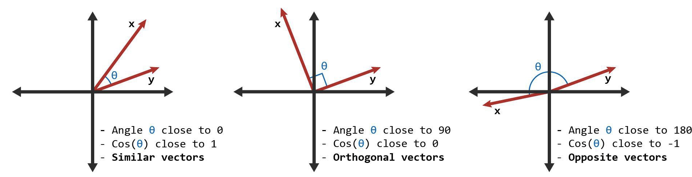

# AI 에이전트 시대의 실전 개발: RAG, Multi-Agent, MCP 정복하기

## 목차

- [RAG의 모든 것](#RAG의-모든-것)
  - [1. AI와 언어모델 기초 이해](#1-AI와-언어모델-기초-이해)
    - [1.1 NLP, Natural Language Processing(자연어 처리)란 무엇인가?](#11-NLP-Natural-Language-Processing자연어-처리란-무엇인가)
    - [1.2 NLP Preprocessing(전처리)](#12-NLP-Preprocessing전처리)
    - [1.3 NLP 주요 Task](#13-NLP-주요-Task)
    - [1.4 NLP 모델링 및 구조](#14-NLP-모델링-및-구조)
    - [1.5 NLP의 논쟁과 한계](#15-NLP의-논쟁과-한계)
    - [1.6 Trasnformer란 무엇인가?](#16-Trasnformer란-무엇인가)
    - [1.7 Transformer 구조](#17-Transformer-구조)
    - [1.8 LLM(대규모 언어모델)의 주요 개념 정리](#18-LLM대규모-언어모델의-주요-개념-정리)
    - [1.9 프롬프트 엔지니어링 기초](#19-프롬프트-엔지니어링-기초)
    - [1.10 컨텍스트 엔지니어링과 정보 처리](#110-컨텍스트-엔지니어링과-정보-처리)
    - [1.11 LLM의 한계: Attention Decay(망각 현상)과 Hallucination(환각 현상)](#111-LLM의-한계-Attention-Decay망각-현상과-Hallucination환각-현상)
  - [2. 임베딩과 벡터 데이터베이스](#2-임베딩과-벡터-데이터베이스)
    - [2.1 Vector(벡터)란 무엇인가?](#21-Vector벡터란-무엇인가)
    - [2.2 임베딩의 원리와 활용](#22-임베딩의-원리와-활용)
    - [2.3 벡터 데이터베이스 구축](#23-벡터-데이터베이스-구축)
  - [3. RAG 시스템 설계와 구현](#3-RAG-시스템-설계와-구현)
    - [3.1 설계 기본](#31-설계-기본)
    - [3.2 RAG가 해결하는 LLM의 문제점](#32-RAG가-해결하는-LLM의-문제점)
    - [3.3 RAG 기법](#33-RAG-기법)
    - [3.4 RAG 성능 최적화 전략](#34-RAG-성능-최적화-전략)
- [에이전트의 모든 것](#에이전트의-모든-것)
  - [4. 단일 에이전트와 멀티 에이전트 시스템](#4-단일-에이전트와-멀티-에이전트-시스템)
    - [4.1 AI 에이전트 기초 개념](#41-AI-에이전트-기초-개념)
    - [4.2 단일 에이전트 시스템 구축](#42-단일-에이전트-시스템-구축)
    - [4.3 멀티 에이전트 시스템 아키텍처](#43-멀티-에이전트-시스템-아키텍처)
- [MCP의 모든 것](#MCP의-모든-것)
  - [5. MCP 활용](#5-MCP-활용)
    - [5.1 MCP(Model Context Protocol) 개요](#51-MCPModel-Context-Protocol-개요)
    - [5.2 MCP 설계 구성 요소 및 작동 방식](#52-MCP-설계-구성-요소-및-작동-방식)

---

## RAG의 모든 것

### 1. AI와 언어모델 기초 이해

#### 1.1 NLP, Natural Language Processing(자연어 처리)란 무엇인가?

NLP란 인간 언어(자연어)를 **컴퓨터가 이해하고 활용할 수 있도 만드는 기술**

- NLP의 두 가지 구성 요소
  - **NLU, Natural Language Understanding(이해): 문장의 의미를 해석**
  - **NLG, Natural Language Generation(생성): 컴퓨터가 새로운 문장을 생성**
- 예시: 사용자가 `"날씨 어때?"`라고 물으면
  - NLU는 `"날씨에 대한 질문"`임을 파악
  - NLG는 `"서울의 날씨는 맑고 28도 입니다"`라는 문장을 생성
- NLP vs 음성 인식
  - NLP는 "텍스트"를 중심으로 작동
  - 음성 인식은 "소리 -> 텍스트"로 변환하는 별도의 기술(Speech Recognition)

---

#### 1.2 NLP Preprocessing(전처리)

- 주요 전처리 기법
  - Tokenization(토큰화): 문장을 **단어/문장/음절 단위로 나눔**
  - Stopword Removal(불용어 제거): **의미 없는 자주 쓰이는 단어 제거**
  - Lemmatization(표제어화) vs Stemming(어간 추출): 단어의 기본형 찾기
    - 예를 들어 `am`, `are`, `is`는 서로 다른 스펠링이지만 그 뿌리 단어는 `be`라고 볼 수 있고 `be`는 표제어
    - 어간 추출은 정해진 규칙만 보고 단어의 어미를 자르는 어림짐작의 작업, `formalize -> formal`, `allowance -> allow`
  - Sentence Segmentation(문장 분리)

---

#### 1.3 NLP 주요 Task

| Task        | 설명              | 활용 예시        |
| ----------- | ----------------- | ---------------- |
| 감정 분석   | 긍정/부정 분류    | 리뷰, 트윗       |
| 번역        | 한->영, 영->한 등 | Google Translate |
| 요약        | 긴 문서를 짧게    | 뉴스 요약        |
| 개체명 인식 | 이름, 장소 추출   | 기사 분석        |
| 질의응답    | 질문에 답변 생성  | 챗봇             |
| 자동 완성   | 입력 중 예측      | 검색엔진, IDE    |
| 정보 검색   | 관련 문서 찾기    | 구글 검색        |

---

#### 1.4 NLP 모델링 및 구조

- 전통 모델
  - Naive Bayes, Logistic Regression, Decision Tree
  - HMM(Part-of-Speech Tagging)
- 딥러닝 모델
  - **RNN, LSTM**, GRU: 시퀀스 처리
  - CNN: 문장 분류
  - **Autoencoder** / Seq2Seq: 번역, 요약 등
  - **Transformer: 현재 NLP 모델의 중심 구조**(GPT, BERT)

---

#### 1.5 NLP의 논쟁과 한계

- 데이터 편향 문제: 사회적 편견이 학습 데이터에 반영될 수 있음
- 설명 가능성 부족: 모델의 판단 근거가 불분명함

---

#### 1.6 Trasnformer란 무엇인가?

- 모델 구성
  - Transformer는 여러 개의 Transformer Block이 순차적으로 연결되어 구성
  - 각 Block은 크게 **Attention Component와 Feed-forward Network로 나뉨**

- **Attention**
  - **문맥 이해를 위해 각 단어가 문장 내 다른 단어와의 관계를 파악**
    - 예: "bank"는 "river"와 "money"를 문맥에 따라 다른 의미를 갖게 됨

  - **Scaled dot-product 방식을 사용해, softmax를 통해 중요도 가중치를 계산**
  - Multi-head attention: 여러 개의 헤드로 병렬 처리하며, 문법, 의미, 위치 관계를 동시에 파악

- **Feed-forward Network**
  - attention 출력을 각 위치마다 추가 처리를 하는 MLP 구조
  - 일반적으로 hidden 크기는 embedding 크기의 4배로 설정

- Positional Encoding
  - Trasnformer는 **순차 정보가 없기 때문에, sin/cos positional encoding을 통해 토큰의 순서를 Embedding 벡터에 더함**

- Encoder-Decoder 구조
  - Encoder: 여러 Block 쌓아 입력 토큰 전체의 문맥적 표현 생성
  - Decoder:
    - 마스크된 self-attention을 사용해 이전 출력 토큰만 참조
    - encoder 출력과 cross-attention을 수행하여 각 단계 예측에 활용

- Residual 연결 및 정규화
  - 각 서브레이어(attention -> feed-forward) 후, residual 연결 + LayerNorm을 적용
  - 초기 Transformer는 post-LN을 사용했지만, 이후 pre-LN 방식이 더 안정적으로 사용

- 본 구조는 BERT, GPT, Claude, Gemini 등 수많은 모델의 기반이 됨

---

#### 1.7 Transformer 구조


- 왼쪽: Encoder 구조

  - **입력 처리:** `"Hello I love you"` 같은 문장
    - `Tokenization & Embedding`
    - `Positional Encoding`을 거쳐 순서 정보를 포함한 임베딩 벡터로 변환
  - **Encoder Layer (N번 반복):**
    - `Multi-Head Attention`: 입력 문장 내 단어들 간의 관계(문맥)를 학습
    - `Add & Layer Norm`: residual 연결 후 정규화
    - `Feed-forward(Linear)`: 개별 토큰에 대해 비선형 변환
    - 다시 `Add & Layer Norm`

- 중앙: Attention 메커니즘 상세

  - 입력 벡터 X = {x₁, x₂, x₃, x₄}: 각 단어의 임베딩

  - 세 개의 가중치 행렬($W_Q$, $W_K$, $W_V$)을 통해 다음 계산 수행:

    **Scaled Dot-Product Attention 연산**: $Attention(Q, K, V) = \text{softmax}\left(\frac{QK^T}{\sqrt{d_k}}\right)V$

    - Transformer에서 사용하는 Attention 메커니즘의 기본 형태로, Query, Key, Value 벡터 사이의 연산을 통해 중요도를 계산하고 가중합을 반환
    - **Q: Query 행렬(입력 단어의 질문 역할)**
    - **K: Key 행렬(다른 단어들과의 매칭 기준)**
    - **V: Value 행렬(실제 정보를 담고 있음)**
    - $d_k$: key 벡터의 차원 수
    - $softmax$: 각 Query-Key 쌍에 대한 유사도 점수를 확률로 변환
    - 동작 순서

      1. Query와 Key 내적 -> 유사도 점수 산출
      2. 유사도 점수에 $\sqrt{d_k}$로 나눠줌 -> Scaling
         - 이유: 차원이 커질 수 록 dot product 값이 커져 $softmax$가 극단화됨 -> 안정화 필요
      3. $softmax$ -> 확률 분포로 변환(어떤 Value를 얼마나 참조할지)
      4. Value와 곱함 -> 최종 Attention 결과 벡터
    - 계산 예시

      | Query  | Key    | 유사도(Q*K) | Scaled        | Softmax | Output    |
      | ------ | ------ | ----------- | ------------- | ------- | --------- |
      | 단어 1 | 단어 A | 10          | 10/√64 ≈ 1.25 | 0.7     | V_A * 0.7 |
      | 단어 1 | 단어 B | 2           | 2/√64 ≈ 0.25  | 0.3     | V_B * 0.3 |

  - 이 과정은 **입력 시퀀스 내에서 어떤 단어가 중요한지를 판단**하는 데 핵심 역할

- 오른쪽: Decoder 구조

  - **입력 문장**: 예를 들어 `"Bonjour je t'aime"` 와 같은 문장이 들어감
  - `Tokenization & Embedding + Positional Encoding` 적용
  - **Decoder Layer (N번 반복)**:
    - `Masked Multi-Head Attention`: 이전 단어까지만 참조 (미래 단어 가려짐)
    - `Multi-Head Attention`: 인코더의 출력과 상호작용 (Context 활용)
    - `Linear`, `Add & Layer Norm` 반복
  - 마지막에 `Linear → Softmax`를 통해 다음 단어 예측

---

#### 1.8 LLM(대규모 언어모델)의 주요 개념 정리

- Pre-training vs Fine-tuning
  - Pre-training(사전 학습)
    - 목적: 대규모 말뭉치(웹 텍스트, 위키백과 등)를 기반으로 **언어의 일반적인 구조와 문맥을 이해하도록 학습**
    - 방식: **주로 다음 단어 예측 또는 빈칸 채우기(Masked Language Modeling)**
    - 특징:
      - **도메인에 구애받지 안고 넓은 범용성을 갖춤**
      - **일반적인 언어 감각, 문법, 개념 구조 등을 파악**하게 됨
    - 예: GPT는 웹 전체 데이터를 기반으로 pre-train되어 있음
  - Fine-tuning(미세 조정)
    - 목적: **사전 학습된 모델을 특정 Task나 도메인에 최적**
    - 방식: **소량의 라벨이 붙은 데이터를 활용**하여 추가 학습
    - 종류:
      - Supervised fine-tuning(SFT)
      - Reinforcement learning with human feedback(RLHF)
      - Instruction tuning
    - 예: 의료 분야에 GPT를 적용하고 싶다면, 의료 문서 데이터로 fine-tuning 필요
- Emergent Abilities(창발적 능력)
  - 정의
    - **모델의 파라미터 수가 커질수록, 작은 모델에서는 없던 새로운 능력**이 나타나는 현상
      - 논리적 추론: 몇몇 논리 문제에서 정답률이 갑자기 상승
      - 다단계 수학 연산: 단계를 나눠 추론(Chain-of-Tought 가능)
      - 영어 -> 코드 번역: 특정 크기 이상의 GPT에서 자연스럽게 등장
      - Emergent Abilities는 모델이 클수록 더 강력하지만 예측 불가능하게 생김
    - 비선형적 변화(크기에 비례하지 않고, **특정 임계점 넘으면 발생**)
- Context Window와 한계
  - Context Window란?
    - **LLM이 한 번에 처리할 수 있는 입력 토큰의 길이**
    - 예: GPT-3는 약 2048 tokens, GPT-4는 최대 128k tokens
  - 한계점
    - **입력이 Context Window를 넘으면 이전 정보가 사라짐**
    - **긴 문서나 코드 등에서는 요약 또는 청킹(Chunking) 기법 필요**
  - 관련 개념
    - 토큰: 단어, 구, 기호 등을 쪼갠 최소 단위(ex. "ChatGPT" -> 2 tokens)
    - Attention의 한계: **모든 토큰을 비교하므로, 길어질수록 제곱 계산량이 제곱 단위로 증가**
    - Long-context techniques: Sliding window, Retrieval-Augmented Generation(RAG), Attention 최적화 등

---

#### 1.9 프롬프트 엔지니어링 기초

- 프롬프트란?

  - 프롬프트(Prompt)는 **LLM에게 무엇을 어떻게 해야 할지 지시하는 입력 문장으로, "모델에게 던지는 질문이자 과업 설명서"**라고 볼 수 있음

- 프롬프트의 구성 요소

  - **System Message**
    - **역할과 행동 지침을 부여**
    - 모델의 전체 성격, 말투, 지식 범위 등을 제어
    - 예시: `너는 전문적인 심리 상담가야. 사용자의 감정을 공감하면서 조언을 해줘.`
  - **User Message**
    - **사용자의 실제 요청 내용**
    - 가능한 구체적으로 작성해야 모델이 정확하게 응답
    - 예시: `요즘 너무 우울한데, 기분이 나아질 방법이 있을까?`
  - **Assistant Message**
    - **이전 Assistant 응답을 통해 대화의 맥락을 유지**
    - 예시: `그럴 때는 일단 자신을 비난하지 않고 감정을 그대로 느끼는 게 중요해요.`

- 효과적인 프롬프트 작성 기법

  1. Few-shot Learning

     - 모델에게 예시를 여러 개 보여주고, 마지막 항목만 추론하게 함

     - 예시:
       ```tex
       Q: 서울은 한국의 수도이다. → True  
       Q: 파리는 미국의 수도이다. → False  
       Q: 도쿄는 일본의 수도이다. → 
       ```

     - 정답: `True`

  2. Chain-of-Thought(CoT)

     - 모델이 한 번에 답을 내지 않고, 단계별 사고 과정을 유도

     - "생각하는 과정을 먼저 보여줘"식 프롬프트

       ```tex
       Q: 철수는 영희보다 키가 크다. 영희는 민수보다 작다. 누가 제일 클까?  
       A: 단계별로 생각해보자. 영희 < 철수, 영희 < 민수 → 철수와 민수 중 비교해야 한다...  
       ```

     - 정확도와 추론 능력 향상

  3. Role Playing

     - 모델에게 역할을 명확하게 부여하면, 응답 품질이 크게 향상됨

       ```tex
       너는 지금부터 노련한 IT 컨설턴트야. 고객의 요구사항을 정리해서 비즈니스 요건으로 바꿔줘.
       ```

     - 캐릭터, 말투, 행동 원칙 등을 포함할 수 있음

  4. 프롬프트 최적화 유의사항

     | 원칙        | 설명                                                    |
     | ----------- | ------------------------------------------------------- |
     | 명확성      | 지시를 구체적으로 작성(모호한 표현 피하기)              |
     | 형식 유도   | 원하는 출력 형태를 명확하게 말해주기(JSON, 표, 코드 등) |
     | 예시 제공   | 모델이 헷갈릴 수 있는 경우에는 예시를 직접 넣어주기     |
     | 반복 테스트 | 작은 변화에도 결과가 달라질 수 있으므로 여러 버전 실험  |

---

#### 1.10 컨텍스트 엔지니어링과 정보 처리

##### 컨텍스트 윈도우 이해와 활용

- 컨텍스트 vs 프롬프트

  | 항목 | 프롬프트                            | 컨텍스트                                                     |
  | ---- | ----------------------------------- | ------------------------------------------------------------ |
  | 정의 | LLM에게 입력하는 질문이나 명령      | 모델이 답변을 생성하기 위해 참고하는 이전 대화/정보 전체     |
  | 형태 | 한 번의 메시지 또는 입력 테스트     | 시스템 메시지, 사용자 메시지, 이전 응답 등 모두 포함된 히스토리 |
  | 역할 | 모델이 수행해야 할 작업을 직접 명시 | 모델이 응답을 생성할 때 배경 정보로 작용                     |
  | 범위 | 특정 요청(예: "이 문장 번역해줘")   | 이전 대화 내용, 시스템 메시지, 사용자 설정 등 모든 이전 입력 |
  | 예시 | "고양이에 대한 시를 써줘"           | 이전 대화: "나는 시를 좋아해요", "강아지에 대한 시도 좋았어요" |

  `"이번에는 일본어로 번역해줘"` -> 프롬프트

  `"그 전에 나는 일본어 공부 중이야", "지난 번에도 일본어로 했었잖아"` -> 컨텍스트

- 토큰 기반 처리

  - **LLM은 모든 입력을 토큰 단위로 처리**
  - 토큰은 단어, 어절, 자소 단위로 분해된 최소 의미 단위(예: 영어는 단어, 한글은 음절이 될 수 있음)
  - 예: `ChatGPT는 놀라워요` → ["Chat", "G", "PT", "는", "놀", "라", "워", "요"] → 약 7~8 tokens

- 토크나이저의 동작 원리

  - 사전 학습된 Byte-Pair Encoding(BPE) 또는 Unigram 알고리즘으로 분리
  - 토큰 사전은 모델마다 다르며, OpenAI, Cohere, Claude, Google 등 모두 고유한 토크나이저 사용

- 토큰 수 계산과 비용 최적화

  - GPT-3.5 기준: 1000 tokens ≒ 약 750~800단어
  - 많은 API들이 **토큰 기준으로 과금**되므로, 짧고 명확한 입력이 중요
  - 긴 컨텍스트를 줄이기 위해선 요약, 중복 제거, 압축이 필요함

- 다국어 처리 시 토큰 효율성

  - **영어 → 적은 토큰 수**, **한글/중국어 → 더 많은 토큰 사용**
  - 번역 기반 비교 시, 영어 입력이 가장 효율적이며, **다국어 입력 시 토큰 수 주의 필요**

##### 컨텍스트 관리 전략

- 중요 정보 우선순위 배치

  - 모델은 앞쪽 정보에 가중치를 더 많이 부여하는 경향이 있음(Attention decay)
  - 따라서 **중요한 정보는 앞에 배치**하는 것이 효과적

- 컨텍스트 압축 기법

  - 요약(summary), 개요(outline), 키워드 리스트로 압축

  - 예시:

    ```tex
    요약: 이 문서는 고객 만족도 향상 전략에 대해 설명합니다.
    키워드: 고객 경험, 응답 시간, 피드백 루프
    ```

- Rolling Window(롤링 윈도우) 방식

  - 일정 간격으로 입력 범위를 앞뒤로 슬라이딩하며 추론
  - 특히 긴 대화나 스트리밍 입력에서 활용됨

##### Chunking(청킹) 전략

- 필요성
  - GPT 계열 모델은 최대 토큰 길이(context window)에 제한이 있음
  - **긴 문서 전체를 넣지 못하는 한계**가 있음 -> 의미 단위로 분할 필요
- 중요한 이유
  - **line split(단순한 자르기)은 문맥 손실 발생**
  - **문단, 주제 단위로 나누어야 검색과 응답 정확도 향상**

##### Chunking 방법론

1. Fixed-size Chunking(고정 크기 청킹)
   - 일정 토큰 수 기준으로 문서를 나눔(예: 500 tokens마다 잘라내기)
   - 장점: 단순하고 빠름
   - 단점: 문장이 중간에 끊겨 의미 손실 가능
2. Semantic Chunking(의미 기반 청킹)
   - 문단/제목/섹션 기준으로 의미 단위로 나눔
   - 예: Heading 기반 분할, 문단 종료 기호(\n\n 등) 기준 분할
   - 장점: 문맥 유지 잘됨
3. Overlap Chunking(중복 청킹)
   - 이전 청크의 일부를 다음 청크에 **겹쳐서 포함**시킴
   - 장점: 문단 경계에서 의미 끊김 방지
   - 일반적으로 10~30% overlap 사용
4. Hierarchical Chunking(계층적 청킹)
   - 전체 문서를 **섹션 → 문단 → 문장** 등으로 다단계 분해
   - RAG나 하향식 검색 시스템에서 사용됨
   - 장점: 문서 구조 보존 + 유연한 검색

---

#### 1.11 LLM의 한계: Attention Decay(망각 현상)과 Hallucination(환각 현상)

- **Attention Decay(망각 현상)**
  - **긴 컨텍스트에서 앞부분 정보에 대한 주의력이 점점 약해지는 현상**
  - 발생 원인:
    - Position Bias: **모델이 최근 토큰에 더 높은 가중치를 부여**하는 경향
    - 어텐션 희석: **컨텍스트가 길어질수록 각 토큰에 할당되는 어텐션 스코어가 분산**
    - Lost in the Middle(중간 손실): 컨텍스트 중간 부분이 가장 먼저 망각되는 U자형 패턴
    - 메모리 용량 한계: **어텐션 매커니즘의 고정된 표현 공간에서 모든 정보를 동등하게 유지하기 어려움**
    - 순차 처리 특성: **왼쪽에서 오른쪽으로 처리하면서 이전 정보의 영향력이 감소**
  - 특성:
    - 시작 부분 선호: 문서 첫 부분은 상대적으로 잘 기억
    - 끝 부분 선호: 가장 최근 정보는 강하게 유지
    - 중간 부분 취약: 컨텍스트 중간이 가장 먼저 망각
    - 거리 의존성: 현재 처리 위치에서 멀수록 영향력 감소
  - 보완책:
    - 중요한 정보를 앞부분에 반복 배치
    - 요약을 통한 핵심 정보 강화
    - 컨텍스트 재정렬 및 Sliding window 활용
- **Hallucination(환각 현상)**
  - **사실이 아닌 정보를 그럴듯하게 생성하는 현상**
  - 발생 원인:
    - 확률적 생성 특성: 다음 토큰을 확률 분포로 예측하다 보니 낮은 확률이지만 틀린 정보 선택 가능
    - 훈련 데이터의 한계: 인터넷의 잘못된 정보, 편향된 데이터, 상충하는 정보가 학습
    - 지식의 압축 손실: 방대한 정보를 모델 파라미터로 압축하는 과정에서 정보 왜곡
    - 컨텍스트 부족: 질문에 대한 충분한 맥락 정보가 없을 때 추측으로 답변 생성
    - Overconfidence(과신): 모델이 불확실한 상황에서도 확신하는 답변을 생성
  - 유형
    - 내재적 할루시네이션: 소스 정보와 완전히 모순되는 내용
    - 외재적 할루시네이션: 소스에 없지만 추가로 생성된 내용
    - 사실적 할루시네이션: 객관적으로 틀린 정보(날짜, 수치, 인명 등)
  - 보완책:
    - 명확한 프롬프트와 역할 지시문 제공(System message)
    - 검증 가능한 외부 정보와 RAG 시스템 연계
    - 응답 후, Post-processing을 통해 사실 검증(Fact-check)

---

### 2. 임베딩과 벡터 데이터베이스

#### 2.1 Vector(벡터)란 무엇인가?

- 정의

  - Vector(벡터)는 숫자들의 리스트(=수치적 배열, 보통 부동소수점 숫자)
  - 머신러닝과 딥러닝에서는 텍스트, 이미지, 오디오 등 비정형 데이터를 수치적으로 표현한 것을 말함
  - 예를 들어, 문장 "Hello world"를 768차원의 벡터 `[0.13, -0.52, ..., 0.91]`로 나타낼 수 있음

- 그래서 왜 벡터가 필요한가?

  - 전통적인 데이터베이스는 **문자열 매칭** 또는 **키워드 기반 검색**만 가능하지만, `"개와 고양이"`와 `"반려동물"`처럼 **의미는 비슷하지만 단어는 다른** 경우에는 검색이 어려움

  - **벡터 표현**은 이러한 의미의 유사성을 **고차원 공간에서의 거리**로 나타냄

    | 문장                       | 벡터                     |
    | -------------------------- | ------------------------ |
    | 강아지가 공원에서 놀고있다 | [0.12, -0.45, ..., 0.67] |
    | 개가 밖에서 뛰어다닌다     | [0.11, -0.46, ..., 0.69] |

    → 두 벡터 간 **코사인 유사도**가 높다면 의미적으로 유사하다고 판단할 수 있음

- Embedding(임베딩)과 벡터의 관계

  - **임베딩**은 자연어, 이미지, 오디오 등을 벡터로 변환하는 과정
  - 이 임베딩 벡터들은 고차원 공간에서 **의미적 특징**을 보존

- 벡터의 수학적 성질

  - Dimension(차원): 일반적으로 128, 256, 768, 1024 차원 등 다양
  - 거리 계산 방법:
    - Cosine Similarity(코사인 유사도): 각도 기반 유사성(텍스트에 자주 사용)
    - 유클리드 거리: 절대 거리
    - dot product(내적): LLM에서는 종종 dot score 활용

---

#### 2.2 임베딩의 원리와 활용

- 벡터 표현의 이해
  - 단어, 문장, 문서를 고차원 벡터 공간에 수치로 표현
  - **의미가 유사한 텍스트끼리 벡터 간 거리가 가깝도록 학습**
  - 예: "강아지"와 "개" -> 유사 벡터 / "강아지"와 "비행기" -> 큰 거리
- 고차원 공간에서의 의미 표현
  - **벡터 공간에서 의미, 유사성, 주제를 정량적으로 비교 가능**
- Cosine Similarity(코사인 유사도)와 거리 측정
  - 유사도 계산에 Cosine Similarity 가장 많이 사용
  - 각도 기반으로 유사성 측정: 1에 가까울 수 록 유사
- Cosine Similarity(코사인 유사도) 설명
  - $CosineSim(A, B) = (A · B) / (||A|| * ||B||)$
  - 두 벡터 사이 **방향(Orientation)** 의 유사성을 측정하는 지표로 벡터의 크기(길이)는 무시하고, 두 벡터가 이루는 **각도 θ의 코사인값**을 통해 얼마나 방향이 가까운지 평가
  - 값의 범위는 $[-1, +1]$이며, 일반적으로 TF-IDF처럼 음수가 없는 경우 0에서 1 사이로 표현
    
  - **1**: 완전 동일한 방향 (θ=0°)
  - **0**: 직교(Orthogonal), 유사성 없음 (θ=90°)
  - **–1**: 반대 방향 (θ=180°)
  - 예를 들어 벡터 A = [3, 2, 0, 5], B = [1, 0, 0, 0] 일 때:
    - **내적**: 3×1 + 2×0 + 0×0 + 5×0 = 3
    - **A의 크기**: √(3²+2²+0²+5²) ≈ 6.16
    - **B의 크기**: √(1²) = 1
    - **코사인 유사도**: 3 / (6.16 × 1) ≈ 0.49 → 약 0.49 유사도 (비율 49%)
    - **Cosine Distance(코사인 거리)**는 대부분 $1 - \text{유사도} = 0.51$ 로 해석
- 임베딩 모델의 종류와 특성
  - **OpenAI text-embedding-ada-002**: 빠르고 범용, GPT 기반 벡터 추출
  - **Sentence-BERT**: 문장 단위 의미 표현에 강함 (semantic similarity에 적합)
  - **Multilingual-E5 / BGE-M3**: 다국어 지원, 다양한 언어간 의미 매칭 가능
  - **도메인 특화 모델**: 법률, 의료, 기술 문서 등에 최적화된 모델도 존재

---

#### 2.3 벡터 데이터베이스 구축

##### 벡터 데이터베이스란 무엇인가?

- 벡터 임베딩(embedding)을 인덱싱하고 저장하며, **유사도 검색(similarity search)을 빠르게 수행할 수 있도록 설계된 데이터베이스이며, 일반적인 CRUD(생성·읽기·수정·삭제), 메타데이터 필터링, 수평적 확장성 등을 지원**
- **전통적인 관계형 데이터베이스는 정형 데이터에 맞춰 설계**되었기 때문에, **고차원의 의미 기반 검색에서는 성능과 확장성 면에서 한계가 있지만, 벡터 DB는 의미적 유사성을 기반으로 한 검색에 최적화**되어 있음

##### 동작 원리

- 벡터 생성 및 저장
  1. LLM이나 특정 임베딩 모델을 통해 텍스트, 이미지 등의 콘텐츠를 **벡터 임베딩**으로 변환
  2. 이 벡터를 원본 콘텐츠의 ID, 메타데이터와 함께 벡터 DB에 저장
- 질의 처리
  - 사용자의 질의도 임베딩 모델을 통해 벡터로 변환한 뒤, 저장된 벡터와 비교
  - 유클리드 거리 또는 코사인 유사도 같은 **Approximate Nearest Neighbor(ANN)** 알고리즘을 이용해 유사한 벡터를 빠르게 검색

##### Pinecone의 주요 기능 및 장점

- **고성능 인덱싱**: HNSW 계층 기반 인덱스로 낮은 지연과 높은 정확도를 제공
- **확장성**: 수십억 개의 벡터를 자동 샤딩, 로드 밸런싱하며 수평 확장
- **실시간 성능**: 동시 읽기/쓰기 지원, 인덱스 업데이트 시 즉각적으로 일관된 상태 유지
- **메타데이터 필터링**: 의미 유사도 기반 검색에 더해 데이터 필터링을 통한 하이브리드 검색 기능 제공
- **서버리스 아키텍처**: 스토리지와 컴퓨팅 자원을 분리하여 비용 효율적이면서도 자동으로 확장 가능한 구조를 지원

##### Use Cases

- **Semantic Search**: 문서 기반 Q&A, 사내 지식 검색 등 의미 기반 이해 중심 검색
- **RAG (Retrieval-Augmented Generation)**: LLM과 벡터 DB 결합으로 최신 또는 도메인 특화 데이터를 활용한 콘텐츠 생성 및 요약
- **추천 시스템**: 사용자 행동이나 콘텐츠 특성을 임베딩하고 유사 항목을 찾아 추천
- **이미지/영상 검색**: 시맨틱 임베딩을 통해 시각적 콘텐츠 유사도 검색
- **이상 탐지, 플라지어즘 검사, 고객 세분화, 바이오·신약 후보 탐색 등** 이외에도 다양한 분야에 활용

##### 벡터 DB 선택 가이드

| 제품     | 특징                                                  |
| -------- | ----------------------------------------------------- |
| Pinecone | SaaS형, 확장성 우수, 빠른 검색, 유료 기반             |
| Weaviate | 오픈소스, hybrid 검색, GraphQL API 지원               |
| Chroma   | 경량화, Python에 최적화된 개발 친화형 DB              |
| FAISS    | Facebook 제공, 로컬 환경에서 빠른 처리, 오픈소스 기반 |

##### 인덱싱 전략

- **HNSW (Hierarchical Navigable Small World)**
  - 그래프 기반 인덱스, 검색 정확도 높고 빠름
  - 대부분의 최신 DB에서 기본 채택
- **IVF (Inverted File Index)**
  - 대량 데이터에서 효율적이나 상대적으로 정확도 낮음
- 성능 vs 정확도 트레이드오프 존재
  - HNSW: 느리지만 정확
  - IVF: 빠르지만 근사값 가능성 있음

---

### 3. RAG 시스템 설계와 구현

#### 3.1 설계 기본

##### RAG Pipeline

```tex
[문서 수집] → [청킹] → [임베딩] → [벡터 DB 저장]
                                  ↓
[사용자 요청] → [임베딩] → [유사도 검색] → [컨텍스트 구성] → [LLM 응답 생성]
```

##### 단계 설명

- **문서 수집**: Web crawler, API, DB dump, pdf, html, markdown 등의 정규과 비정형 데이터를 수집
- **Chunking(청킹)**: 문서를 특정 토큰 길이로 조각화
- **Embedding(임베딩)**: 문서 청킹을 벡터 공간으로 경본화(BERT, Ada-002, SBERT 등 사용)
- **벡터 DB 저장**: FAISS, Pinecone, Weaviate, Qdrant 등
- **사용자 요청 임베딩**: 사용자의 요청 작업을 embedding
- **유사도 검색**: Approximate Nearest Neighbor(ANN)을 통해 바로가지 유사한 청킹 데이터 검색
- **컨텍스트 구성**: 검색 결과를 합치고 LLM에서 사용할 추가 컨텍스트로 조합
- **LLM의 응답**: 설정된 Prompt 보고 답변 생성(출처 인용 포함 가능)

---

#### 3.2 RAG가 해결하는 LLM의 문제점

| 문제                           | RAG 해결 방식                              |
| ------------------------------ | ------------------------------------------ |
| 할루시네이션                   | 실제 문서를 기반으로 생성하여 완화         |
| 최신성 불가                    | 외부 DB, 크롤링 등으로 최신 정보 반영 가능 |
| 출처 확인 불가                 | 벡터 DB 메타데이터 기반으로 출처 표기 가능 |
| 도메인 전문성 부족             | 도메인 문서만 확보하면 별도 학습 없이 가능 |
| 긴 입력에 대한 Attention Decay | 컨텍스트 최소화로 decay 방지               |

---

#### 3.3 RAG 기법

- 하이브리드 검색
  - 키워드 기반 검색 (BM25 등) + 벡터 기반 검색 (임베딩) 결합
  - 다양한 검색 조건을 융합하여 recall 향상
- Re-ranking(후처리 정렬)
  - 최초 검색 결과에 대해 cross-encoder나 LLM scoring 기반으로 정확도 중심 재정렬
  - 최종적으로 상위 n개만 추출
- Query Expansion
  - 원 질문을 유의어, 하위 질문 등으로 변형 -> 검색 recall 향상
  - 예: "애플 창업자" -> "스티브 잡스", "Apple founder"
- Multi-hop Reasoning
  - 복수 문서를 연결해 추론 → 단일 문서로는 찾기 힘든 응답 생성
  - 체이닝된 retrieval + multi-context prompting 사용

---

#### 3.4 RAG 성능 최적화 전략

- 할루시네이션 방지

  | 전략                 | 설명                                                     |
  | -------------------- | -------------------------------------------------------- |
  | Confidence Scoring   | LLM 응답의 신뢰도를 score로 측정하여 threshold 이하 제거 |
  | Citation Enforcement | 인용 문서 외의 정보는 생성 제한                          |
  | Fact Verification    | 외부 검증기 or 후처리 모델로 사실 검증 단계 추가         |
  | Unknown Detection    | "모르겠다" 응답 허용으로 거짓 생성 방지                  |

- 검색 품질 개선

  | 전략                | 설명                                                         |
  | ------------------- | ------------------------------------------------------------ |
  | 메타데이터 필터링   | 출처, 날짜, 카테고리 기반 쿼리 제한으로 precision 향상       |
  | 문서 계층 구조 보존 | 제목/본문/하위 섹션 구조 그대로 청킹 구성 (context preservation) |
  | 동적 청크 크기      | 문서 길이, 구문 단위에 따라 토큰 수를 조절한 adaptive chunking |

- 응답 품질 향상

  | 전략                 | 설명                                                  |
  | -------------------- | ----------------------------------------------------- |
  | 컨텍스트 순서 최적화 | 중요한 정보 순서 조정 → 답변 논리성 향상              |
  | 중복 제거            | 동일 정보 반복 시 제거하여 프롬프트 공간 절약         |
  | 출처 명시            | 각 문단/문장 단위 인용 가능하게 ID, 링크, 문서명 삽입 |

---

## 에이전트의 모든 것

### 4. 단일 에이전트와 멀티 에이전트 시스템

#### 4.1 AI 에이전트 기초 개념

- 에이전트의 정의 및 특징

  - 주어진 목표를 달성하기 위해 환경을 인지하고 합리적 의사결정을 통해 목표 지향적 행동을 수행하는 시스템

    | 유형            | 설명                                                         |
    | --------------- | ------------------------------------------------------------ |
    | Reactive Agent  | 환경의 변화에 즉시 반응하는 단순한 반사적 행동 기반 에이전트 |
    | Proactive Agent | 목표를 가지고 계획적으로 행동하는 목표 지향형 에이전트       |
    | Social Agent    | 다른 에이전트와 상호작용하며 협력하는 에이전트               |
    | Learning Agent  | 경험을 통해 스스로 개선하고 학습하는 능력을 가진 에이전트    |

- 에이전트 성숙도 분류

  | 수준                | 설명                                                 |
  | ------------------- | ---------------------------------------------------- |
  | Level 1(Chain)      | 사전 정의된 순서 기반 자동화                         |
  | Level 2(Workflow)   | 상황에 맞게 유연하게 순서를 조정하는 워크플로우 수행 |
  | Level 3(Autonomous) | 자율적으로 목표 달성을 위한 계획, 실행, 적응 수행    |

- 에이전트 아키텍처 패턴

  - ReAct(Reasoning and Acting)
    - 사고 → 행동 → 관찰의 반복 사이클
    - 실시간 추론 및 실행을 통해 동적 문제 해결
    - 행동 결과 기반으로 사고를 업데이트하며 수정 가능
  - Plan-and-Execute
    - 초기 계획 수립 → 단계적 실행
    - 실패 시 계획 수정 또는 재계획 가능
    - 복잡한 작업을 구조적으로 처리 가능

---

#### 4.2 단일 에이전트 시스템 구축

- 도구 통합 및 Function Calling

  - 외부 시스템 및 기능을 호출하기 위한 API 기반 함수 정의 필요
  - 기능 스키마 정의, 입력 검증, 오류 처리, 비동기 실행 등 필수 구성 요소 포함

  | 도구 유형        | 예시 기능                  |
  | ---------------- | -------------------------- |
  | 정보 검색        | 웹 검색, DB 쿼리           |
  | 데이터 처리      | 파일 입출력, 수치 계산     |
  | 외부 시스템 호출 | API 호출, 이메일 발송      |
  | 코드 실행        | 파이썬 인터프리터, 셀 명령 |

- 메모리 시스템 설계

  | 메모리 유형 | 기능 설명                                              |
  | ----------- | ------------------------------------------------------ |
  | 단기 메모리 | 현재 대화 컨텍스트 유지                                |
  | 작업 메모리 | 현재 수행 중인 작업의 상태 저장                        |
  | 장기 메모리 | 사용자 정보, 선호도, 과거 상호작용 저장                |
  | 벡터 메모리 | 과거 경험을 임베딩 형태로 저장하고 의미 기반 검색 가능 |

- 에이전트 평가와 최적화

  - 신뢰성 확보
    - 할루시네이션 탐지: 응답 사실성 검증
    - 불확실성 표현: 확신도 기반 답변 차별화
    - 다중 검증: 다양한 소스로 검증
    - Human-in-the-loop: 중요한 판단에 인간 개입 가능화
  - 성능 지표
    - Task Completion Rate(작업 완료율
    - Accuracy(정확도)
    - Efficiency(효율성)
    - User Satisfaction(사용자 만족도)
  - 디버깅과 모니터링
    - 행동 로그 기록
    - 실패 사례 분석
    - A/B 테스트 통한 개선

---

#### 4.3 멀티 에이전트 시스템 아키텍처

- 협력 패턴

  | 유형        | 설명                                              |
  | ----------- | ------------------------------------------------- |
  | 파이프라인  | 에이전트 간 순차적 작업 수행                      |
  | 병렬 처리   | 동시에 여러 작업을 수행하고 결과 통합             |
  | 투표 시스템 | 다수의 결과 중 선택하거나 평균을 내는 방식의 결정 |

- 경쟁 패턴

  | 유형             | 설명                                                  |
  | ---------------- | ----------------------------------------------------- |
  | 토론 시스템      | 서로 다른 관점을 제시하고 논의 통해 결과 도출         |
  | 검증 시스템      | 메인 에이전트의 출력에 대해 보조 에이전트가 검증 수행 |
  | 전략적 상호 작용 | 경쟁을 통한 최적화 또는 협상 시나리오 설계            |

- 에이전트 간 통신 방식

  - 메시지 패싱

    - 비동기 큐 기반 메시지 송수신
    - 브로드캐스트(다수 대상) vs 유니캐스트(단일 대상)
    - 메시지 순서 보장 또는 확인 필요

  - 공유 메모리

    - 전역 상태 공유 방식
    - 동시성 제어 필요 (락, 뮤텍스 등)
    - 일관된 데이터 동기화 방식 구현 필요

  - 에이전트 조정 전략

    | 방식             | 특징                                                   |
    | ---------------- | ------------------------------------------------------ |
    | 중앙 집중형 조정 | 오케스트레이터 또는 마스터 에이전트가 전체 시스템 관리 |
    | 분산현 조정      | 각 에이전트가 자율적 결정을 내리고 협상을 통해 조정    |

---

## MCP의 모든 것

### 5. MCP 활용

#### 5.1 MCP(Model Context Protocol) 개요

- 정의 및 발전 배경
  - **Model Context Protocol(MCP)**은 Anthropic이 2024년 11월에 공개한 **오픈 표준(OSS)** 프로토콜이며, AI 모델(LLM)과 외부 시스템 간 **표준화된 연결을 제공하는 통신 프로토콜**
  - USB-C 포트처럼, AI 애플리케이션이 다양한 도구와 데이터 소스로 **동일한 방식으로 연결 가능**하게 해주는 범용 인터페이스
  - 기존의 N×M 개별 통합을 MCP 하나의 인터페이스로 대체해 **확장성과 유지보수성을 향상**
  - **Language Server Protocol (LSP)**의 메시지 흐름 아이디어를 의도적으로 재사용하며, **JSON-RPC 2.0** 위에서 전송
- 주요 플랫폼 채택 현황
  - **OpenAI**: 2025년 3월 공식 채택 발표. Agents SDK, ChatGPT 데스크톱 앱, Responses API에 MCP 지원 통합
  - **Google DeepMind**: 2025년 4월 Gemini 모델과 SDK에 MCP 지원 추가 발표. CEO Demis Hassabis는 "AI 에이전트 시대의 급속히 성장하는 오픈 표준"이라고 언급
  - **Microsoft**: Copilot Studio와 Azure AI Foundry에서 MCP 지원

---

#### 5.2 MCP 설계 구성 요소 및 작동 방식

- 아키텍처 구성 요소

  | 구성 요소       | 역할 및 설명                                                 | 구체적 예시                                                  |
  | --------------- | ------------------------------------------------------------ | ------------------------------------------------------------ |
  | MCP Host        | AI 애플리케이션(LLM 기반 에이전트) 역할, 사용자 요청을 분석하고 필요한 도구를 판단 | Claude Desktop 앱, ChatGPT 데스크톱,  VS Code의 AI 확장, 커스텀 AI 챗봇 |
  | MCP Client      | Host 내부의 MCP 프로토콜 구현체, JSON-RPC 메시지를 생성하고 서버와 통신 | Anthropic의 Python/TypeScript SDK, OpenAI Agents SDK의 MCP 모듈, 개발자가 구현한 MCP 클라이언트 라이브러리 |
  | MCP Server      | 실제 도구와 데이터를 제공하는 백엔드 서비스, 특정 기능(파일 접근, API 호출 등)을 MCP 프로토콜로 노출 | GitHub MCP Server (레포지토리 관리), Slack MCP Server (메시지 전송), Filesystem MCP Server (로컬 파일 작업), PostgreSQL MCP Server (DB 쿼리) |
  | Transport Layer | 실제 데이터가 오가는 통신 계층, JSON-RPC 2.0 메시지를 전송하는 방식 | **stdio**: 로컬 프로세스와 파이프로 통신, **HTTP/SSE**: 원격 서버와 웹 프로토콜로 통신, **WebSocket**: 실시간 양방향 통신 |

- 주요 기능

  - 요청/응답 구조

    - **JSON-RPC 2.0 프로토콜 기반으로 모든 통신이 구조화된 메시지**로 이루어짐
    - 상태 있는 연결: 한 번 연결되면 여러 요청을 계속 주고받을 수 있음
    - 능력 협상: **서버가 "나는 파일 읽기, 쓰기, 검색을 할 수 있어요"라고 자신의 기능을 알려줌**

  - 도구, 리소스 정의

    - Resoruces(정적 데이터)
      - 예시: `file:///home/user/project/README.md` (로컬 파일)
      - 예시: `postgres://table/users` (데이터베이스 테이블)
      - 예시: `github://repo/issues` (GitHub 이슈 목록)
    - Prompts(템플릿 명령)
      - 예시: "코드 리뷰 프롬프트" → `{code}를 검토하고 개선점 3가지를 제안해주세요`
      - 예시: "문서 요약 프롬프트" → `{document}의 핵심 내용을 3줄로 요약해주세요`
    - Tools(실행 가능한 함수)
      - 예시: `git_commit(message: string)` → Git 커밋 실행
      - 예시: `send_slack_message(channel: string, text: string)` → Slack 메시지 전송
      - 예시: `query_database(sql: string)` → SQL 쿼리 실행
    - 보조 기능
      - 진행 추적: "파일 업로드 중... 60% 완료"
      - 요청 취소: 사용자가 중간에 작업을 중단할 수 있음
      - 오류 보고: "파일을 찾을 수 없습니다" 등의 구체적 에러 메시지

  - MCP 서버 배포 유형

    1. **stdio 서버**: 애플리케이션의 하위 프로세스로 로컬 실행
    2. **HTTP over SSE 서버**: 원격 실행, URL을 통한 연결
    3. **Streamable HTTP 서버**: MCP 스펙에 정의된 Streamable HTTP 전송 사용

  - MCP 워크플로우 흐름

    - 시나리오: "GitHub 이슈를 Slack으로 요약해서 보내기"

      1. 초기 연결 및 능력 협상

         ```tex
         사용자: "최근 GitHub 이슈들을 요약해서 Slack으로 보내줘"
         
         [Host] Claude Desktop이 사용 가능한 MCP 서버들을 확인
         ├── GitHub MCP Server 발견
         │   └── 제공 기능: list_issues, get_issue_details, create_issue
         ├── Slack MCP Server 발견
         │   └── 제공 기능: send_message, list_channels, get_user_info
         └── 연결 성공, 각 서버의 능력 목록 수신
         ```

      2. 요청 분석 및 도구 선택

         ```tex
         [Host] AI가 요청을 분석:
         "GitHub에서 이슈를 가져와야 함 → GitHub MCP Server 필요"
         "Slack으로 보내야 함 → Slack MCP Server 필요"
         "요약이 필요함 → AI가 직접 처리"
         
         선택된 도구:
         1. GitHub.list_issues() - 최근 이슈 목록 가져오기
         2. Slack.send_message() - 요약 내용 전송
         ```

      3. 순차적 도구 실행

         ```tex
         [Host → GitHub Server] JSON-RPC 요청 전송:
         {
           "jsonrpc": "2.0",
           "method": "tools/call",
           "params": {
             "name": "list_issues",
             "arguments": {
               "repo": "my-project",
               "state": "open",
               "limit": 10
             }
           }
         }
         
         [GitHub Server → Host] 응답:
         {
           "jsonrpc": "2.0",
           "result": {
             "issues": [
               {"id": 123, "title": "버그: 로그인 실패", "body": "..."},
               {"id": 124, "title": "기능: 다크모드 추가", "body": "..."}
             ]
           }
         }
         ```

      4. AI 처리 및 결과 생성

         ```tex
         [Host] AI가 받은 데이터를 처리:
         "GitHub 이슈 2개 확인:
         1. 버그: 로그인 실패 - 우선순위 높음
         2. 기능: 다크모드 추가 - 개발 진행 중
         
         요약: 현재 로그인 버그가 가장 시급한 문제..."
         ```

      5. 최종 결과 전송

         ```tex
         [Host → Slack Server] JSON-RPC 요청:
         {
           "jsonrpc": "2.0",
           "method": "tools/call", 
           "params": {
             "name": "send_message",
             "arguments": {
               "channel": "#dev-team",
               "text": "📋 GitHub 이슈 요약:\n1. 버그: 로그인 실패 (우선)\n2. 기능: 다크모드 추가"
             }
           }
         }
         
         [Slack Server → Host] 성공 응답:
         {
           "jsonrpc": "2.0", 
           "result": {"message_id": "msg_123", "status": "sent"}
         }
         ```

      6. 사용자에게 최종 보고

         ```tex
         [Host → 사용자] 
         "완료했습니다!
         - GitHub에서 최근 이슈 2개를 확인했습니다
         - 요약 내용을 #dev-team 채널로 전송했습니다
         - 로그인 버그가 가장 시급한 문제로 확인됩니다"
         ```

    - 에처 처리 예시

      - 연결 실패 시

        ```tex
        [GitHub Server] 오프라인 → Host가 자동으로 대체 방안 제시
        "GitHub 서버에 연결할 수 없습니다. 로컬 이슈 백업 파일을 확인할까요?"
        ```

      - 권한 부족 시

        ```tex
        [Slack Server] 권한 없음 → 구체적 안내 제공
        "Slack 채널 접근 권한이 없습니다. 관리자에게 #dev-team 채널 권한을 요청해주세요"
        ```

  - MCP 활용 사례

    - 개발 환경 통합

      1. 지능형 코드 리뷰 어시스턴트

         ```tex
         개발자: "이 PR을 리뷰해줘"
         
         워크플로우:
         1. [GitHub MCP] → PR 파일 변경 사항 가져오기
         2. [Filesystem MCP] → 관련 테스트 파일들 읽기  
         3. [AI 분석] → 코드 품질, 보안 이슈, 테스트 커버리지 검토
         4. [GitHub MCP] → 리뷰 코멘트 자동 작성
         5. [Slack MCP] → 팀에게 리뷰 완료 알림
         
         실제 결과: "코드에서 SQL 인젝션 위험 발견, 테스트 케이스 3개 추가 필요"

      2. Vibe Coding 맥락 인식 개발 지원

         ```tex
         개발자: "사용자 인증 기능을 구현하려고 해"
         
         실시간 지원:
         1. [Filesystem MCP] → 현재 프로젝트 구조 분석
         2. [Git MCP] → 이전 인증 관련 커밋 히스토리 확인  
         3. [Package Manager MCP] → 관련 라이브러리 의존성 체크
         4. [Documentation MCP] → 팀 코딩 가이드라인 참조
         
         제안: "기존 JWT 패턴을 따라 구현하되, 새로운 bcrypt 버전 사용을 권장합니다"

    - 기업용 애플리케이션

      1. 영업 팀 AI 어시스턴트

         ```tex
         영업팀: "이번 분기 서울 지역 매출 현황을 보고서로 만들어줘"
         
         처리 과정:
         1. [Salesforce MCP] → 서울 지역 거래 데이터 추출
         2. [Excel MCP] → 분기별 매출 트렌드 계산
         3. [Email MCP] → 고객 피드백 최신 동향 수집
         4. [PowerPoint MCP] → 자동 보고서 생성
         5. [Calendar MCP] → 다음 영업 회의 일정에 자동 추가
         
         결과: 20페이지 분량의 데이터 기반 영업 보고서 + 액션 아이템

      2. HR 온보딩 자동화

         ```tex
         HR 담당자: "신입사원 김철수님 온보딩을 시작해줘"
         
         자동화 워크플로우:
         1. [HRMS MCP] → 신입사원 기본 정보 및 부서 확인
         2. [Active Directory MCP] → 계정 생성 및 권한 할당
         3. [Slack MCP] → 팀 채널 초대 및 환영 메시지
         4. [Calendar MCP] → 첫 주 일정 및 멘토 미팅 예약
         5. [Document MCP] → 개인화된 온보딩 가이드 생성
         6. [Email MCP] → 관련 부서에 신입사원 소개 이메일 발송
         
         효과: 기존 3일 소요 작업을 30분으로 단축

    - 전문 도메인 적용

      1. 의료진 의사결정 지원

         ```tex
         의사: "이 환자의 증상과 유사한 최근 논문들을 찾아줘"
         
         연구 워크플로우:
         1. [EMR MCP] → 환자 증상 및 검사 결과 추출
         2. [PubMed MCP] → 관련 최신 의학 논문 검색
         3. [PDF Parser MCP] → 논문 내용 분석 및 핵심 정보 추출
         4. [Drug Database MCP] → 권장 치료법과 약물 상호작용 체크
         5. [Hospital System MCP] → 병원 내 유사 케이스 검색
         
         제공 결과: 증거 기반 치료 권장안 + 주의사항 + 참고 논문 목록

      2. 금융 리스크 분석

         ```tex
         리스크 분석가: "이 포트폴리오의 리스크를 평가해줘"
         
         분석 프로세스:
         1. [Trading System MCP] → 현재 포지션 및 거래 내역
         2. [Market Data MCP] → 실시간 시장 데이터 및 변동성 지표  
         3. [News MCP] → 관련 기업/산업 뉴스 센티먼트 분석
         4. [Regulatory MCP] → 최신 규제 변화 영향 평가
         5. [Risk Model MCP] → VaR, 스트레스 테스트 실행
         6. [Report MCP] → 리스크 보고서 자동 생성
         
         결과: 실시간 리스크 대시보드 + 알람 설정 + 헤지 전략 제안

    - 창의적인 활용 사례

      1. 콘텐츠 크리에이터 워크플로우

         ```tex
         유튜버: "어제 라이브 스트림을 편집해서 숏폼 영상 3개 만들어줘"
         
         자동화 파이프라인:
         1. [Video MCP] → 라이브 스트림 파일 분석 및 하이라이트 추출
         2. [Speech-to-Text MCP] → 음성을 텍스트로 변환
         3. [Sentiment Analysis MCP] → 시청자 반응이 좋았던 구간 식별
         4. [Video Editor MCP] → 자동 편집 및 자막 생성
         5. [Thumbnail MCP] → AI 기반 썸네일 디자인
         6. [YouTube MCP] → 메타데이터와 함께 자동 업로드
         7. [Social Media MCP] → 인스타그램, 틱톡에 크로스 포스팅
         
         효과: 8시간 작업을 1시간으로 단축, 일관된 품질 유지
         ```

  - MCP 보안 이슈와 대응 방안

    - 최근 발견된 주요 보안 취약점
      - Critical CVEs(2025년)
        1. CVE-2025-6514(CVSS 9.6): mcp-remote의 원격 코드 실행 취약점
        2. CVE-2025-49596(CVSS 9.4): MCP Inspector의 브라우저 기반 RCE 취약점
        3. CVE-2025-53110 & CVE-2025-53109: Filesystem MCP Server의 디렉터리 탐색 및 심볼릭 링크 우회 취약점
    - 보안 위협 유형
      1. Command Injection: 사용자 입력을 셸 명령으로 직접 전달하는 취약점(43%의 오픈소스 MCP 서버에서 발견)
      2. Server Spoofing: 악성 서버가 검증된 서버로 위장
      3. Rug Pull 공격: 신뢰받던 서버가 악성 기능으로 업데이트된 후 다시 정상으로 복원
      4. Agent Deception: 공개 문서에 숨겨진 악성 MCP 명령으로 에이전트 조작
      5. Cross-Server Shadowing: 여러 MCP 서버 간 부적절한 상호작용 유도
    - 보안 모범 사례
      - 인증 강화: OAuth 2.1 토큰 사용, 짧은 수명의 범위 제한 토큰 발급
      - 최소 권한 원칙: 필요한 도구만 사용, 최소 범위로 제한
      - 버전 고정 및 검증: 서명된 해시로 업데이트 검증
      - 메타데이터 검토: 모든 도구 메타데이터 리뷰, 예상치 못한 업데이트 모니터링
      - 입력 검증: JSON 스키마 강제, 길이 제한, 경로 허용 목록 적용
      - 출력 정화: 도구 출력을 모델 컨텍스트에 재입력하기 전 정화
      - 로깅 및 모니터링: 모든 도구 호출 로그, 비정상적인 활동 패턴 감지
    - 프로토콜 레벨 한계
      - URL의 세션 ID: 프로토콜 스펙에서 URL에 세션 식별자를 요구하여 보안 모범 사례 위반
      - 인증 표준 부족: 일관성 없는 보안 구현으로 이어지는 최소한의 인증 가이던스
      - 무결성 제어 부족: 메시지 서명이나 검증 메커니즘 부재

---
