# Software Enginnering

### 블랙박스 테스트(Black-box Testing)

#### 개요

- **정의**: 내부 구조나 구현을 고려하지 않고, **입력(Input) → 출력(Output)** 에 집중하여 기능을 검증하는 테스트 기법.
- **관점**: 개발자가 아닌 **사용자의 관점**에서 수행.
- **활용 시점**: 주로 **시스템 테스트** 및 **승인 테스트** 단계.

------

#### 동등 분할 테스팅(Equivalence Partitioning)

- **정의**: 입력 데이터를 **동등 클래스(Equivalence Class)** 로 나누고, 각 클래스에서 대표값 하나만 선택해 테스트.
- **장점**: 테스트 케이스 수를 줄이면서도 커버리지 확보 가능.

#### 유형

- **유효 분할**: 정상적으로 처리해야 하는 값 (예: 0~12 = "어린이")
- **비유효 분할**: 거부/무시해야 하는 값 (예: 음수, 문자 입력 등)

#### 커버리지

- 각 분할을 최소 한 번 테스트하면 100% 달성

#### 예시(나이 입력 앱)

- 0~12: 어린이
- 13~19: 청소년
- 20~59: 성인
- 60 이상: 노인
- 비유효 입력: 음수, 문자열

------

#### 경계값 분석(Boundary Value Analysis, BVA)

- **정의**: 오류가 발생하기 쉬운 **경계 값** 중심으로 테스트.
- **적용**: 연속적, 정렬된 입력 값에 적합.

#### 유형

- **2-value BVA**: 경계값과 인접 값 (예: 최소값, 최소+1, 최대값, 최대-1)
- **3-value BVA**: 경계값과 양 옆 값 (예: -1, 0, 1)

#### 예시(성적 계산 앱)

- 구간:
  - 0~59: F
  - 60~69: D
  - 70~79: C
  - 80~89: B
  - 90~100: A
- 경계값: 0, 59, 60, 69, 70, 79, 80, 89, 90, 100
- 테스트 케이스: -1, 0, 1 / 59, 60, 61 / 89, 90, 91 / 100, 101 등

------

#### 결정 테이블 테스팅(Decision Table Testing)

- **정의**: 여러 조건과 그에 따른 동작을 **테이블 형식**으로 표현 → 모든 조건 조합을 테스트.
- **장점**: 복잡한 비즈니스 로직 검증에 효과적.

#### 구성

- 행(Row): 조건 / 결과
- 열(Column): 조건의 조합(규칙)

#### 예시

- 조건: 회원 여부 / 구매 금액 / 쿠폰 사용 여부
- 결과: 할인 여부
- → 회원+200달러 이상+쿠폰 사용 = 할인 적용
- → 비회원+100달러 미만 = 할인 없음

------

#### 상태 전이 테스팅(State Transition Testing)

- **정의**: 시스템이 특정 **상태 → 다른 상태** 로 전이될 때의 동작 검증.
- **도구**: 상태 다이어그램, 상태 전이 테이블

#### 커버리지 기준

- **모든 상태 커버리지**: 모든 상태를 최소 1회 이상 테스트
- **유효 전이 커버리지**: 모든 유효 전이를 실행
- **모든 전이 커버리지**: 유효/비유효 전이 모두 실행

#### 예시(자판기)

- 상태: 대기 → 선택 → 결제 → 상품 제공
- 이벤트: 동전 투입 / 상품 선택 / 결제 / 초기화
- 테스트 케이스:
  - TC1: [대기] + 동전 투입 → [선택]
  - TC2: [선택] + 상품 선택 → [결제]
  - TC3: [결제] + 상품 제공 → [상품 제공]
  - TC4: [상품 제공] + 초기화 → [대기]

------

#### 분류 트리 기법(Classification Tree Method, CTM)

- **정의**: 소프트웨어의 입력 조건, 상태, 동작을 **트리 구조로 분류**하여 체계적으로 테스트 케이스를 설계하는 기법.
- **장점**: 시각화로 조건 누락/중복 최소화, 동등 분할·경계값 분석과 병행 가능.
- **활용 도구**: TestOptimal, CTE(Classification Tree Editor) 등.

#### 예시(로그인 기능)

- 분류 기준: [아이디] [비밀번호] [네트워크 상태]
- 값:
  - 아이디: 존재/미존재
  - 비밀번호: 정상/오류/빈값
  - 네트워크: 정상/끊김
- → 조합을 통해 모든 입력 조건에 대한 테스트 케이스 도출 가능

------

#### 페어와이즈 테스팅(Pairwise Testing)

- **정의**: 대부분의 결함은 **두 인자 조합**에서 발생한다는 경험적 법칙을 활용해, 모든 2-way 조합을 커버하는 최소한의 테스트 케이스를 생성하는 기법.
- **장점**: 테스트 수 대폭 축소(효율성 ↑), 주요 결함 발견 가능성 높음.
- **한계**: 3-way 이상 인자 간 상호작용에서 발생하는 결함은 놓칠 수 있음.
- **활용 도구**: PICT(Microsoft), ACTS(NIST), Pairwiser 등.

#### 예시(브라우저 호환성)

- 파라미터:
  - OS: Windows / macOS / Linux
  - 브라우저: Chrome / Firefox / Edge / Safari
  - 언어: 한국어 / 영어 / 일본어
- 전체 조합 = 3 × 4 × 3 = 36개 → Pairwise 적용 시 약 9~10개 케이스로 축소 가능

------

#### 블랙박스 테스트 요약표

| 기법               | 초점               | 장점                  | 예시                   |
| ------------------ | ------------------ | --------------------- | ---------------------- |
| **동등 분할**      | 입력 값의 클래스   | 테스트 케이스 축소    | 나이 → 어린이/성인     |
| **경계값 분석**    | 경계값             | 오류 탐지 용이        | 성적 A/B 경계값        |
| **결정 테이블**    | 조건 조합          | 복잡한 로직 테스트    | 회원+쿠폰+금액         |
| **상태 전이**      | 상태와 이벤트      | 동적 동작 검증        | 자판기 상태 변화       |
| **분류 트리 기법** | 조건 분류와 조합   | 시각화, 누락 최소화   | 로그인 조건 트리       |
| **페어와이즈**     | 인자 간 2-way 조합 | 최소 케이스로 효율성↑ | 브라우저 호환성 테스트 |

---

### 화이트박스 테스트(White-box Testing)

#### 개요

- **정의**: 소프트웨어의 **내부 구조, 로직, 소스코드** 기반으로 테스트 케이스를 설계하는 기법
- **관점**: **개발자 관점** (코드 동작을 직접 검증)
- **활용 시점**: 주로 **단위 테스트(Unit Test)**, **통합 테스트(Integration Test)** 단계

#### 장점

- 코드의 모든 경로를 철저하게 점검 → 숨은 결함 탐지
- 복잡한 조건문, 반복문에 대한 로직 결함 확인 가능

#### 단점

- 내부 구조를 알아야 하므로 **개발 지식 필요**
- 코드 변경 시 테스트 케이스 유지 비용 증가

------

#### 주요 기법

##### 구조적 커버리지(Code Coverage)

테스트 범위를 정량적으로 측정하기 위해 사용하는 지표

> 단, **100% 커버리지 = 결함 없음**은 아님. (안전 산업에선 보조 지표로 활용)

------

##### 구문 커버리지(Statement Coverage)

- **정의**: 모든 코드 라인이 한 번 이상 실행되었는지 측정
- **공식**: 실행된 구문 수 / 전체 구문 수 × 100
- **예시**: `if`문 내부 실행 안 되면 커버리지 미달

------

##### 결정 커버리지(Decision Coverage, Branch Coverage)

- **정의**: 조건식의 **True/False 분기**가 모두 실행되었는지 확인
- **목적**: 분기 흐름 전체 테스트
- **예시**: `if (x>3 && y<6)` → 전체 조건식이 true/false 모두 나와야 함

------

##### 조건 커버리지(Condition Coverage)

- **정의**: 조건식 내부의 **각 조건**이 true/false 모두 평가되었는지 측정
- **예시**: `x > 3 && y < 6` →
  - 조건① `x > 3` : true/false 모두 필요
  - 조건② `y < 6` : true/false 모두 필요

------

##### 조건/결정 커버리지(Condition/Decision Coverage)

- **정의**: **조건 커버리지 + 결정 커버리지** 동시 충족
- **장점**: 조건식 내부 + 전체 분기 흐름 동시 보장
- **예시**: 하나의 조합만으로도 조건·분기 모두 커버 가능

------

##### 변형 조건/결정 커버리지(MC/DC)

- **정의**: 각 조건이 **독립적으로 전체 분기 결과에 영향을 미치는지** 확인
- **필수 산업 표준**: 항공(DO-178C), 자동차(ISO 26262)
- **특징**: N개의 조건 → 최소 N+1 테스트 필요
- **예시**: `if ((x>3 || y<6) && z==20)`
  - 조건 하나만 바꿔도 결과가 변해야 함

------

##### 다중 조건 커버리지(Multiple Condition Coverage, MCC)

- **정의**: 모든 조건식 조합을 테스트 (완전탐색)
- **공식**: (실행된 조건 조합 수 / 전체 조건 조합 수) × 100
- **예시**: 3개 조건 → 2³ = 8개 테스트 케이스 필요
- **단점**: 조합 수 폭발 → 현실 적용 어려움

------

#### 커버리지 비교 정리

| 커버리지 유형 | 초점        | 테스트 요구사항      | 난이도    | 특징           |
| ------------- | ----------- | -------------------- | --------- | -------------- |
| **구문**      | 코드 라인   | 모든 구문 실행       | 낮음      | 기본 지표      |
| **결정**      | 조건식 결과 | True/False 분기 실행 | 보통      | 분기 흐름 확인 |
| **조건**      | 개별 조건   | 조건별 True/False    | 보통      | 조합 미보장    |
| **조건/결정** | 조건+분기   | 두 기준 모두 충족    | 보통↑     | 효율적         |
| **MC/DC**     | 독립적 영향 | 조건별 독립성 확인   | 높음      | 안전 산업 필수 |
| **다중 조건** | 모든 조합   | 모든 경우의 수       | 매우 높음 | 이론적, 실무↓  |

---

### 요구사항 도출 기법(Requirement Elicitation Techniques)

### 정의

시스템이 충족해야 할 요구사항을 **이해관계자와의 소통이나 분석을 통해 수집하는 활동**
 하나의 기법으로 충분하지 않으며, **복합적으로 활용**해야 신뢰성 있는 요구 도출 가능

------

### 대표 기법 및 비교

| 기법                              | 설명                                    | 장점                     | 단점                   | 활용 예               |
| --------------------------------- | --------------------------------------- | ------------------------ | ---------------------- | --------------------- |
| **인터뷰**                        | 사용자 또는 전문가에게 직접 질문        | 심층 정보 수집 가능      | 주관성, 시간 소요      | 관리자 인터뷰         |
| **설문조사**                      | 구조화된 질문지를 통해 다수의 응답 수집 | 정량적 데이터 확보       | 얕은 정보, 설계 어려움 | UX 만족도             |
| **관찰 / 현장조사 (Observation)** | 사용자의 실제 작업을 관찰               | 실제 사용 방식 이해 가능 | 시간·비용 소요         | 병원 업무 관찰        |
| **워크숍 / 브레인스토밍**         | 여러 이해관계자와 함께 아이디어 도출    | 창의성, 공감대 형성      | 수렴 어려움            | 서비스 개선 논의      |
| **문서분석**                      | 기존 정책, 매뉴얼, 시스템 문서 분석     | 빠른 초기 이해           | 현실과 불일치 가능성   | 기존 시스템 정책 확인 |

---

### 기능 요구사항 vs 비기능 요구사항

#### 정의

| 분류            | 설명                                            | 예시                        |
| --------------- | ----------------------------------------------- | --------------------------- |
| 기능 요구사항   | 시스템이 **무엇을 해야 하는가**                 | 로그인, 검색, 장바구니 추가 |
| 비기능 요구사항 | 시스템이 **어떻게 작동해야 하는가** (품질 기준) | 응답시간, 보안, 접근성 등   |

---

#### 비교

| 항목      | 기능 요구사항      | 비기능 요구사항                |
| --------- | ------------------ | ------------------------------ |
| 목적      | 기능 구현          | 품질 보장                      |
| 작성 방식 | "무엇을 할 것인가" | "어떤 조건 하에 동작할 것인가" |
| 검증 방법 | 시나리오 테스트    | 성능 측정, 품질 평가 등        |

---

### 테스트 가능성 (Testability)

#### 정의

요구사항은 **테스트 가능한 형태로 명확히 기술되어야 하며**, 추상적 표현은 테스트 기준을 만들기 어려움

---

#### 좋은 요구사항 작성 예

| 나쁜 예                     | 좋은 예                       |
| --------------------------- | ----------------------------- |
| 시스템이 빠르게 동작해야 함 | 응답시간 2초 이내로 결과 반환 |
| 사용자 불만이 없도록 한다   | 실패율 1% 이하로 유지         |

---

### Agile 핵심 개념: Sprint, User Story, 회고, Demo

#### 핵심 구성요소

| 요소              | 설명                                              | 활용 목적         |
| ----------------- | ------------------------------------------------- | ----------------- |
| **Sprint**        | 정해진 기간(보통 2주)의 반복 개발 주기            | 점진적 개발       |
| **User Story**    | 사용자 중심의 요구 표현 ("나는 ~로서 ~하고 싶다") | 요구사항 정의     |
| **Demo**          | 스프린트 종료 후 결과물 시연                      | 이해관계자와 공유 |
| **Retrospective** | 개발 프로세스 개선 회의                           | 지속적 품질 향상  |

---

#### 상호작용 구조

1. User Story 선정
2. Sprint 동안 개발
3. Demo로 산출물 공유
4. 회고(Retrospective)로 개선 사항 도출
5. 다음 Story 우선순위 재조정

---

### 인터페이스 정의서 구성 요소

| 항목                   | 설명                           |
| ---------------------- | ------------------------------ |
| **API 경로 및 메서드** | 예: `/payment/confirm` - POST  |
| **요청(Request)**      | 입력 필드명, 타입, 필수 여부   |
| **응답(Response)**     | 반환 코드, 메시지, 데이터 구조 |
| **예시(JSON)**         | 실제 입력/출력 예시 포함       |

---

### 결정 테이블 (Decision Table)

#### 정의

**모든 조건 조합**에 대해 **시스템의 행동을 표 형태로 정의**하여 **누락과 충돌을 방지**하는 기법.

---

#### 구성 요소

| 구성    | 설명                                 |
| ------- | ------------------------------------ |
| 조건    | 입력 조건 (예: 회원 등급, 결제 수단) |
| 조건 값 | 조건별 값 (일반/프리미엄, 카드 등)   |
| 행동    | 결과 (할인율, 서비스 등)             |
| 행동 값 | 행동 실행 여부                       |

---

#### 예시

| 회원등급 | 결제수단 | 할인율 | 사은품 |
| -------- | -------- | ------ | ------ |
| 일반     | 카드     | 5%     | X      |
| 일반     | 계좌이체 | 5%     | O      |
| 프리미엄 | 카드     | 10%    | X      |
| 프리미엄 | 계좌이체 | 10%    | O      |

---

#### 장단점

| 장점                     | 단점                    |
| ------------------------ | ----------------------- |
| 조건 누락 방지           | 조건 많아지면 조합 폭증 |
| 명확한 커뮤니케이션 수단 | 작성 어려움, 도출 복잡  |

---

### 실시간 처리(Online) vs 배치 처리(Batch)

#### 실시간 처리(Online Interface)

- **정의**: 요청 시 즉시 응답하는 데이터 처리 방식
- **특징**
  - 낮은 지연 시간(Latency)
  - 요청-응답 구조
  - 사용자 경험(UX)과 직결
- **예시**: 로그인, 결제 승인, 주문 확인

---

#### 배치 처리(Batch Interface)

- **정의**: 대량의 데이터를 일정 주기로 모아 한 번에 처리.
- **특징**
  - 처리 효율·성능 최적화
  - 스케줄 기반 실행
- **예시**: 일일 리포트, 월말 마감, 데이터 마이그레이션

---

#### 비교

| 구분      | 실시간       | 배치             |
| --------- | ------------ | ---------------- |
| 처리 시점 | 요청 시 즉시 | 특정 주기        |
| 장점      | UX 향상      | 대용량 효율 처리 |
| 단점      | 부하 증가    | 최신성 떨어짐    |

---

### 데이터 표준화와 구조 설계

#### 데이터 표준화(Data Standardization)

- **정의**: 시스템 전반에서 데이터 명칭, 형식, 코드 값을 일관되게 정의
- **목적**: 호환성, 유지보수성, 오류 감소
- **표준**: ISO/IEC 11179 메타데이터 표준

---

#### 도메인 설계(Domain Modeling)

- **정의**: 특정 업무 영역의 데이터 구조와 제약 정의
- **관련 개념**: ERD(Entity Relationship Diagram), 데이터 무결성

---

#### JSON(JavaScript Object Notation)

- **정의**: 경량 데이터 교환 포맷(RFC 8259)
- **특징**: Key-Value, 배열, 중첩 객체, 언어 독립적
- **반대 개념/대안**: XML, Protocol Buffers(Protobuf), YAML

---

### 출력 데이터(Out Data)와 입력 데이터(In Data) 설계

#### Out 데이터 설계 원칙

- **핵심**: 하위 호환성 유지, 구조 단순화, 필드 최소화
- **모범사례**: 핵심 식별자 + 상태코드만 반환, 세부 데이터는 별도 API
- **위험**: 모든 상세 데이터를 한 번에 반환 → 변경 영향 커짐

---

#### In 데이터 설계 원칙

- **핵심**: 필수/선택 구분, 배열 처리 원칙
- **JSON Schema**: `required` 속성, 데이터 타입 명시
- **위험**: 선택 항목 미명시 시 파싱 오류·호환성 문제 발생

---

### 복합 데이터 구조 설계와 확장성

#### 복합 데이터 처리

- **문제 상황**: 텍스트 + 이미지 + 동영상 같이 서로 다른 타입을 하나의 응답에 포함

- **해결책**: 각 항목에 `type` 필드 명시

- **예시**:

  ```json
  [
    { "type": "text", "value": "Hello" },
    { "type": "image", "url": "https://..." }
  ]
  ```

---

#### 데이터 그룹 구조 설계

- **Wrapper Object 방식**: 모든 그룹을 상위 객체에 포함 (`menu.coffees`, `menu.breads`)
- **Resource 분리 방식**: 최상위에 각각의 그룹(`coffees`, `breads`)
- **반대 개념**: 동적 구조(Dynamic Schema) → 필드 구성이 요청마다 달라짐 (비권장)

---

### 요구사항 분석과 검증

#### 요구사항 분석

- **정의**: 시스템이 수행해야 할 기능/비기능 요구를 도출
- **도출 기법**: 인터뷰, 설문, 관찰, 워크숍, 문서분석
- **연관 개념**: 기능 요구사항 vs 비기능 요구사항, 유스케이스(Use Case)

---

#### 검증(Validation)

- **목적**: 요구사항 정의서와 설계 산출물의 일관성, 완전성 확인
- **기법**
  - 리뷰(Review)
  - 워크스루(Walkthrough)
  - 인스펙션(Inspection)
- **반대 개념**: Verification(검증)과 Validation(확인)의 차이
  - Verification: "제대로 만들었는가?"(설계·코드 검토)
  - Validation: "올바른 것을 만들었는가?"(요구사항 충족 여부 확인)

---

### 업무흐름도와 역할자

#### 업무흐름도(Business Process Flow)

- **표준**: BPMN 2.0
- **오류 유형**: 흐름 누락, 잘못된 역할자, 조건 분기 오류, 중복 단계
- **수정 방법**: 표준 기호 재작성, 로직 재검토, 단계 병합

---

#### 역할자(Role)

- **정의**: 프로세스 단계별 책임 주체
- **세분화 필요**: 권한, 데이터 접근 범위, 업무 책임이 다른 경우
- **연관 개념**: RACI 매트릭스, Actor(UML)

---

### 마이크로서비스 아키텍처(Microservice Architecutre)

#### 아키텍처 스타일로서의 마이크로서비스

- **핵심 아이디어**: 기능적 분해(Functional Decomposition) → 단일 모놀리식 대신 독립적 서비스들의 집합으로 애플리케이션 구성
- **소프트웨어 아키텍처 정의**: 구성요소, 관계, 속성의 집합. 품질 요구사항(확장성, 신뢰성, 유지보수성, 테스트 용이성, 배포 용이성)을 충족하는 데 핵심 역할

#### 서비스와 느슨한 연결

- **서비스(Service)**: 독립 배포 가능한 컴포넌트, API(커맨드, 쿼리, 이벤트)를 통해 외부와 상호작용
- **느슨한 연결(Loose Coupling)**:
  - API를 통한 캡슐화된 통신만 허용
  - 내부 구현 변경이 클라이언트에 영향 없음
  - 데이터베이스 직접 공유 금지 → 격리성↑, 정합성 관리 어려움

**정리**: 마이크로서비스 아키텍처 = 독립적 서비스 + 느슨한 연결
 개발 속성(유지보수성, 배포 용이성, 테스트 용이성)과 확장성 향상

------

#### 마이크로서비스 정의

##### 시스템 오퍼레이션 식별

1. **요구사항 → 시스템 오퍼레이션(System Operation)** 추출
   - **Command**: 데이터 생성/수정/삭제
   - **Query**: 데이터 조회/읽기
2. **도메인 모델 정의**
   - 사용자 스토리의 명사 → 핵심 클래스 도출
   - 이벤트 스토밍 활용 가능
   - 각 서비스는 독립 도메인 모델 보유
3. **오퍼레이션 명세**
   - 입력 값, 반환 값, 행위 등 상세 정의

------

#### 서비스 정의(분해 패턴)

##### (1) 비즈니스 역량 기반 분해

- **비즈니스 역량(Business Capability)**: 조직이 "무엇(What)"을 하는지에서 도출
- **특징**: 변화가 적어 아키텍처 안정성↑
- 예: 보험(인수·클레임 관리), 온라인 스토어(주문·재고·배송)

##### (2) 하위 도메인 기반 분해 (DDD)

- **하위 도메인(Subdomain)**: 제한 영역(Bounded Context)별로 서비스 정의
- **DDD와 MSA의 조화**:
  - 하위 도메인 ↔ 서비스
  - 자율적 팀 ↔ 도메인 모델 소유 팀

##### (3) 분해 가이드라인

- **SRP (Single Responsibility Principle)**: 서비스는 하나의 변경 사유만 가져야 함
- **CCP (Common Closure Principle)**: 동일 사유로 변경되는 컴포넌트들은 같은 서비스로 묶어야 함

------

#### 서비스 API 정의

- **오퍼레이션 할당**: 핵심 정보를 소유한 서비스에 배정
- **협업 API 정의**: 여러 서비스 데이터가 필요한 경우 협업 위한 API 추가 설계 필요

---

#### 마이크로서비스의 프로세스 간 통신(IPC)

##### 마이크로서비스 관점에서의 IPC

- **모놀리식**: 함수/메소드 호출로 모듈 간 기능 호출 가능
- **마이크로서비스**: 독립 서비스 간 **프로세스 간 통신(IPC)** 필요
- **중요성**: 어떤 IPC 메커니즘을 선택하느냐가 **가용성, 확장성, 신뢰성**에 큰 영향

------

#### 상호작용 스타일

서비스와 클라이언트 간 통신은 다음 두 기준으로 나눔:

- **참여자 수**: 일대일(One-to-One), 일대다(One-to-Many)
- **응답 방식**: 동기(Sync), 비동기(Async)

| 구분   | 일대일                        | 일대다                      |
| ------ | ----------------------------- | --------------------------- |
| 동기   | 요청/응답 (Request/Response)  | -                           |
| 비동기 | 비동기 요청/응답, 일방향 알림 | 게시/구독, 게시/비동기 응답 |

- **요청/응답**: 응답 올 때까지 대기
- **비동기 요청/응답**: 즉시 후속 처리, 응답은 나중에
- **일방향 알림**: 응답 없이 전달
- **게시/구독**: 이벤트를 여러 소비자에게 전달
- **게시/비동기 응답**: 게시 후 응답을 받는 혼합 방식

------

#### API 설계 – API First Approach

- **IPC 방식**에 따라 API 정의 방식 달라짐
  - **HTTP/REST**: URL, Verb(GET/POST 등), 요청·응답 포맷
  - **메시징**: 채널, 메시지 유형, 메시지 포맷(JSON/Avro 등)

------

#### API 변화 관리 – 시맨틱 버저닝

- **버전 번호 규칙**: `MAJOR.MINOR.PATCH`
  - **MAJOR**: 호환 불가 변경
  - **MINOR**: 호환 유지 + 기능 추가
  - **PATCH**: 호환 유지 + 버그 수정
- **원칙**
  - 가능하면 이전 버전과 **호환성 유지**
  - 호환 불가 변경 시 일정 기간 **구/신 버전 동시 운영** 필요
  - REST라면 URL에 버전(`/v1/…`) 포함하거나 Content Negotiation 활용

------

#### 메시지 포맷

- **텍스트 포맷**: JSON, XML
  - 장점: 읽기 쉬움, 확장 용이
  - 단점: 크기와 오버헤드↑
- **바이너리 포맷**: Protocol Buffers, Avro
  - 장점: 성능↑, 효율↑
  - 특징: IDL 정의 → 자동 코드 생성

------

#### 원격 프로시저 호출 기반 동기 통신

- **특징**: 요청-응답 기반, 주로 동기식 → 부분 실패 관리 필수
- **대표 기술**:
  - **REST**: HTTP + 리소스 중심, Verb 활용 (GET, POST, PUT 등)
  - **gRPC**: HTTP/2 기반, 프로토콜 버퍼 사용, 다국어 지원, 스트리밍 가능

#### 부분 실패 처리

- 분산 환경 특성상 서비스 장애·지연 가능
- **대응 기법** (Netflix 사례):
  - **Timeout**: 대기 시간 제한
  - **요청 수 제한**: 미처리 요청 상한 설정
  - **서킷 브레이커**: 실패율 ↑ → 회로 차단 → 일정 시간 후 재시도
  - **Fallback**: 기본값/캐시값 반환

#### 서비스 탐색 (Service Discovery)

- 클라우드 환경: 서비스 주소(IP/Port)가 동적 변경
- **구현 방식**:
  - **애플리케이션 레벨**: 서비스 ↔ 서비스 레지스트리 직접 통신
  - **플랫폼 제공**: Kubernetes, Docker 등 내장 탐색 기능 활용

------

#### 메시징 기반 비동기 통신

- **특징**: 요청과 응답이 비동기, 클라이언트는 대기 없이 후속 처리 가능
- **메시지 구조**: 헤더(메타데이터) + 본문(데이터)
- **유형**:
  - 문서(Document): 단순 데이터 응답
  - 커맨드(Command): RPC 유사, 오퍼레이션 명시
  - 이벤트(Event): 상태 변화 알림

#### 메시지 채널

- **점대점(P2P)**: 1:1 전달 → 커맨드 메시지에 적합
- **게시/구독(Pub/Sub)**: 1:N 전달 → 이벤트 메시지에 적합

#### 상호작용 구현

- **비동기 요청/응답**: ID 기반 매칭 필요
- **일방향 알림**: 단순 전달
- **게시/구독**: 이벤트 전달
- **게시/비동기 응답**: Pub/Sub + 응답 결합

#### 메시징 기반 API 문서화

- **요청/응답 API**: 채널명 + 메시지 유형/포맷 + 응답 명세
- **이벤트 API**: 채널명 + 이벤트 유형/포맷

#### 메시지 브로커

- **브로커리스** (ZeroMQ 등): 지연↓, 단일 장애점 없음, 그러나 가용성/전송 보장 문제↑
- **브로커 기반** (RabbitMQ, Kafka, ActiveMQ, AWS SQS 등):
  - 장점: 느슨한 연결, 메시지 버퍼링, 다양한 통신 패턴 지원
  - 단점: 성능 병목, 단일 장애점, 운영 복잡성

#### 메시지 전달 순서 보장

- **문제**: 멀티 인스턴스 환경에서 메시지 순서 보장 어려움
- **해결**: 샤드 채널(Partition) + Consumer Group (Kafka, Kinesis)
  - 특정 키(예: OrderId)로 파티션 지정 → 순서 보장

#### 중복 메시지 처리

- 메시지 “최소 1회 전달” 보장 시 중복 발생 가능
- **해결책**: 메시지 ID 추적 후 DB에 저장 → 신규 메시지만 처리

------

#### 가용성 향상 전략

- 동기 통신은 가용성↓, 가능하면 **비동기 메시징 활용** 권장
- **대안 기법**:
  1. **데이터 복제**: 필요한 데이터 복제 + 이벤트 구독으로 최신화 유지
  2. **응답 우선 회신 후 잔여 처리**: 클라이언트에 먼저 응답, 후속 검증/작업은 비동기 진행

---

#### Saga를 이용한 트랜잭션 관리

##### 마이크로서비스 아키텍처에서의 트랜잭션

- **모놀리식**: 단일 DB, ACID 트랜잭션으로 간단히 정합성 보장
- **MSA**: 데이터가 여러 서비스에 분산 → 전통적인 **분산 트랜잭션(2PC)** 불가
  - NoSQL, 메시지 브로커 대부분 2PC 미지원
  - 가용성 저하(참여 서비스 모두 가용해야 커밋 가능)
- **대안**: 느슨한 연결 + 비동기 기반의 **Saga 패턴**

------

#### Saga의 기본 개념

- **정의**: 순차적으로 실행되는 로컬 트랜잭션 집합
  - 각 단계는 **ACID 로컬 트랜잭션**
  - 단계 간 연결은 **비동기 메시징(Event/Message)**
- **장점**: 모든 단계가 반드시 수행되도록 메시지 브로커가 보장

#### 주문 생성 Saga 예시

1. 주문 서비스 – `APPROVAL_PENDING` 상태 주문 생성
2. 소비자 서비스 – 소비자 유효성 검증
3. 주방 서비스 – 주문 검증 후 `CREATE_PENDING` 티켓 생성
4. 회계 서비스 – 신용카드 승인
5. 주방 서비스 – 티켓 상태 `AWAITING_ACCEPTANCE` 변경
6. 주문 서비스 – 주문 상태 `APPROVED` 변경

------

#### 보상 트랜잭션 (Compensating Transaction)

- **ACID 롤백 불가** → **역 트랜잭션 실행** 필요
- 트랜잭션 유형
  - **원복 가능(Compensatable)**: 실패 시 취소 가능
  - **피봇(Pivot)**: 성공 시 이후 단계 확정 (Go/No Go 결정점)
  - **재시도(Retriable)**: 이후 단계는 반드시 성공(재시도 가능)

#### 예시(카드 인증 실패 시)

- 기존 변경: 주문 생성, 소비자 검증, 티켓 생성
- 실패 지점: 카드 인증 → `CreditCardAuthorizationFailed`
- 보상: 티켓 상태 `REJECTED`, 주문 상태 `REJECTED`

------

#### Saga 구현 방식

#### 코레오그레피 (Choreography)

- **특징**: 중앙 조율자 없음, 서비스들이 이벤트를 게시/구독
- **장점**: 단순성, 느슨한 연결(Loose Coupling)
- **단점**:
  - 조율 로직이 분산 → 이해·관리 어려움
  - 순환 의존성 위험
  - 이벤트 구독 과다 → 강한 연결로 변질 위험

→ **단순한 Saga에 적합**

------

#### 오케스트레이션 (Orchestration)

- **특징**: 중앙 오케스트레이터가 커맨드/응답으로 조율
- **모델링 방법**: 상태 머신(State Machine)
  - 예: `Verifying Consumer → CreatingTicket → Authorizing Card → Approved/Rejected`
- **장점**:
  - 순환 의존성 없음
  - 조율 로직 집중화 → 참여 서비스 단순화
  - 관심사 분리 개선
- **단점**:
  - 오케스트레이터에 비즈니스 로직 과도 집중 위험
  - 해결책: **순서만 담당, 비즈니스 로직은 각 서비스에 남겨야 함**

→ **복잡한 Saga에 적합**

------

#### 격리성 부족 문제

- Saga = **ACD (원자성·일관성·내구성)**, 격리성(Isolation) 약함
- 문제(Anomalies):
  - **Lost Updates**: 한 Saga 변경이 다른 Saga에 덮어씌워짐
  - **Dirty Reads**: 아직 완료 안 된 변경을 다른 Saga가 읽음
  - **Nonrepeatable Reads**: 같은 Saga 내 두 번 읽었는데 결과 다름

------

#### 격리성 부족 대응책

- **Semantic Lock**: 레코드에 “수정 중” 플래그 → 이후 트랜잭션 제한
- **Commutative Updates**: 순서 무관한 교환적 연산으로 설계 (예: Debit/Credit)
- **Pessimistic View**: 트랜잭션 순서 재조정 → Dirty Read 최소화
- **Reread Value**: 업데이트 전 레코드 다시 읽어 확인 (Optimistic Lock)
- **Version File**: 비교환 연산을 기록/재정렬하여 순서 강제
- **By Value**: 위험도에 따라 Saga/분산 트랜잭션 혼합 사용

---

#### 비즈니스 로직 구성 패턴

##### 트랜잭션 스크립트 패턴 (Transaction Script Pattern)

- 요청 유형별로 **절차적 트랜잭션 스크립트** 작성 → 단순한 비즈니스 로직에 적합
- 장점: 단순성, 구현 용이성
- 단점: 로직이 복잡해지면 유지보수 어려움, 모놀리식처럼 비대해질 수 있음

##### 도메인 모델 패턴 (Domain Model Pattern)

- **객체 지향 설계** 기반 → 비즈니스 로직을 상태(state)와 행위(behavior)를 가진 다수의 작은 클래스들로 구성
- 장점:
  - 유지보수 용이, 이해하기 쉬움 (현실 세계와 매핑)
  - 독립적 테스트 가능
  - 확장성 우수 (전략 패턴, 템플릿 메소드 등 활용)

##### 도메인 주도 설계 (DDD)

- **복잡한 비즈니스 로직**에 적합한 객체지향 설계 방법론
- **Bounded Context(제한된 영역)**, **Sub Domain(서브 도메인)** 활용
- 전술적 패턴:
  - **엔티티(Entity)** – 고유 ID 보유, 영속성
  - **값 객체(Value Object)** – 속성값 집합, 불변성
  - **팩토리(Factory)** – 복잡한 생성 로직 담당
  - **저장소(Repository)** – DB 접근 캡슐화
  - **서비스(Service)** – 엔티티/VO에 속하지 않는 로직 구현

------

#### 집합체 (Aggregate) 패턴

##### 전통적인 객체 모델의 문제

- 클래스 간 경계 불명확 →
  - 오퍼레이션 범위 모호 (예: 주문 생성 시 주문, 아이템, 결제 등 포함 범위 불명확)
  - 불변 규칙(Invariant) 보장 어려움 (예: 최소 주문 금액 유지)

##### 집합체 정의

- **루트 엔티티 + 엔티티 + 값 객체** 집합
- 하나의 경계 단위로 관리
- 예: 주문 집합체 = 주문 엔티티 + 주문 라인 아이템 + 주소/결제 VO

##### 집합체 규칙

1. **루트 엔티티를 통해서만 접근** (정합성 보장)
2. **집합체 간 참조는 Primary Key 기반** (느슨한 결합, DB 확장성↑)
3. **하나의 트랜잭션은 하나의 집합체만 수정** (MSA/NoSQL 환경 적합, 다중 집합체는 Saga 활용)

##### 집합체 크기 결정

- **작게 설계 권장** (동시성↑, 확장성↑, 충돌↓)
- 크면 원자적 업데이트는 유리하지만 확장성과 독립성이 저하됨

##### 집합체 기반 비즈니스 로직 설계

- **비즈니스 로직 = 집합체 + Saga + 도메인 서비스**
- Saga → 다수 서비스에 걸친 데이터 정합성 유지
- Repository → 집합체 저장·조회
- 서비스(Service) → 인바운드 어댑터 호출, 집합체 관리, Saga 실행

------

#### 도메인 이벤트 (Domain Event) 패턴

##### 도메인 이벤트 개념

- 집합체의 **상태 변화**를 나타내는 사건 (ex: `OrderCreated`, `OrderCancelled`, `OrderShipped`)
- 과거분사 형태 이름, 부가 속성 포함 (메타데이터, 타임스탬프, 사용자 ID 등)
- 이벤트 발생 시 관련 소비자에게 게시

##### 이벤트 식별 – 이벤트 스토밍(Event Storming)

1. 이벤트 도출 (브레인스토밍)
2. 이벤트 트리거 식별
3. 이벤트를 소비하는 집합체 식별

→ 빠른 도메인 모델링 기법

##### 이벤트 생성·게시

- **집합체 → 이벤트 생성**
- **서비스 → 이벤트 게시** (의존성 주입 통해 메시징 API 활용)
- 이벤트 전달 보장 → **트랜잭션 메시징 패턴(Outbox Pattern)**
  - DB 트랜잭션 내에서 Outbox 테이블에 기록
  - 커밋 후 Outbox → 메시지 브로커 게시

##### 이벤트 소비

- Kafka 등 메시지 브로커를 통해 전달
- 소비자는 핸들러에서 이벤트 수신 → 관련 집합체/데이터 업데이트
- 예: 식당 메뉴 변경 이벤트 수신 → 주방 서비스의 메뉴 복제본 갱신

---

#### MSA 설계 원칙

##### MSA 정의

- MSA = **하나의 거대한 애플리케이션을 작고 독립적인 서비스들로 분할한 아키텍처**
- 각 서비스 = **특정 비즈니스 기능 담당 + 독립적 개발/배포/운영 가능**

##### 핵심 설계 원칙

1. **단일 책임 원칙 (SRP)**
   - 서비스는 **하나의 비즈니스 기능**만 담당
   - 서비스 경계 = 도메인 경계
   - 변경 영향 최소화
2. **느슨한 결합 (Loose Coupling)**
   - 서비스 간 결합도 최소화
   - 방법:
     - API 기반 통신 (REST, gRPC, GraphQL 등)
     - **데이터베이스 분리** (서비스별 DB 소유)
     - 이벤트 기반 비동기 메시징 (Kafka, RabbitMQ 등)
3. **서비스 독립성 (Service Autonomy)**
   - 독립적 개발/배포/확장/운영 가능
   - 각 팀이 독립적인 기술 스택 사용 가능
4. **장애 격리 (Failure Isolation)**
   - 장애 전파 차단
   - 방법:
     - Circuit Breaker, Timeout, Retry
     - Bulkhead 패턴 (리소스 격리)
     - 서비스별 인프라 분리
5. **자동화 (Automation)**
   - 복잡성 대응을 위한 자동화 필수
   - 영역: CI/CD, 모니터링, 자동 스케일링, 롤백, 장애 복구

------

#### MSA 설계 패턴

##### 분해 패턴 (Decomposition)

- **비즈니스 능력별 분해**: 기능 단위로 분리 (예: 송금, 결제, 주문 서비스)
- **도메인별 분해**: DDD 기반 서브도메인 단위 분리 (예: 계좌, 결제, 고객 인증)

##### 통신 패턴 (Communication)

1. **동기 통신** (Request/Response)
   - REST, gRPC, GraphQL
   - 장점: 직관적, 즉시 응답
   - 단점: 장애 전파 위험
2. **비동기 통신** (Event-driven)
   - Kafka, RabbitMQ, AWS SQS/SNS
   - 장점: 확장성, 장애 격리에 유리
   - 단점: 메시지 처리 복잡성 증가

##### API 관리 패턴

1. **API Gateway 패턴**
   - 단일 진입점 제공
   - 기능: 인증/인가, 로드밸런싱, 로깅, 요청/응답 변환
   - 장점: 클라이언트-서비스 결합도 감소, 공통 기능 집중 관리
   - 단점: SPOF(단일 장애점) 위험, 과도한 로직 집중 가능
2. **BFF (Backend for Frontend) 패턴**
   - 클라이언트별 맞춤형 API 제공
   - 장점: 클라이언트 최적화, 개발 독립성↑
   - 단점: 서비스 수 증가 → 관리 복잡성, 중복 로직 발생 가능

##### 데이터 관리 패턴

1. **Aggregation (API Composition) 패턴**
   - 여러 서비스에서 데이터 조회 → 단일 응답 조합
   - 장점: 클라이언트 요청 최소화
   - 단점: Aggregator 자체가 SPOF 가능
2. **Orchestration 패턴**
   - 중앙 오케스트레이터가 서비스 호출·흐름 제어
   - 장점: 복잡한 워크플로우/예외 처리 용이
   - 단점: 중앙 집중화로 병목·SPOF 위험
3. **CQRS (Command Query Responsibility Segregation)**
   - 명령(Command)과 조회(Query) 모델 분리
   - 장점: 읽기/쓰기 분리 → 성능·확장성↑
   - 단점: 데이터 동기화 지연(최종 일관성), 복잡성 증가

------

#### MSA 설계 원칙 & 패턴 요약표

| 분류        | 패턴/원칙     | 목적                    | 구현/적용 시기         |
| ----------- | ------------- | ----------------------- | ---------------------- |
| 설계 원칙   | 단일 책임     | 서비스 경계 명확화      | 도메인 기준 분리       |
| 설계 원칙   | 느슨한 결합   | 독립성 보장             | API, DB 분리, 이벤트   |
| 설계 원칙   | 서비스 독립성 | 자율적 개발·배포        | 팀 단위 운영           |
| 설계 원칙   | 장애 격리     | 안정성 확보             | Circuit Breaker 등     |
| 설계 원칙   | 자동화        | 운영 효율성             | CI/CD, 모니터링        |
| 분해 패턴   | 능력별 분해   | 기능 중심 서비스 분리   | 초기 설계              |
| 분해 패턴   | 도메인별 분해 | 도메인 경계 기반 분리   | DDD 적용 시            |
| 통신 패턴   | 동기 통신     | 실시간 응답             | 즉시 응답 필요         |
| 통신 패턴   | 비동기 통신   | 높은 처리량·격리성      | 대규모 트래픽          |
| API 패턴    | API Gateway   | 단일 진입점·통합 관리   | 다수 서비스 존재       |
| API 패턴    | BFF           | 클라이언트 맞춤형 API   | 웹/모바일 분리 필요    |
| 데이터 패턴 | Aggregation   | 여러 서비스 데이터 조합 | 클라이언트 요청 최소화 |
| 데이터 패턴 | Orchestration | 프로세스 중앙 제어      | 복잡한 트랜잭션        |
| 데이터 패턴 | CQRS          | 읽기/쓰기 분리          | 고성능/확장 요구       |

---

#### 애플리케이션 패턴

##### 데이터 일관성의 전환 → **결과적 일관성 (Eventual Consistency)**

- 기존: 데이터는 항상 **실시간 강한 일관성(Strong Consistency)** 유지 필요
- 전환: 일부 비즈니스는 **즉시 일관성 필요 없음**, 일정 시간 내 동기화되면 충분
- 예시:
  - 주문 → 결제 → 이메일 발송 (실시간 순차 처리 시 주문 폭주 시 병목 발생)
  - 블랙 프라이데이와 같은 대규모 이벤트 → "결제 지연보다 주문 먼저 확보"가 더 중요

**해결책 → Saga + 이벤트 기반 비동기 통신**

- 각 서비스 트랜잭션은 **독립적** 수행
- 성공 시 **상태 변경 이벤트 발행**
- 다른 서비스는 이벤트 구독 후 자체 트랜잭션 실행
- 장애 발생 시 **실패 이벤트 발행 → 보상 트랜잭션 처리 가능**
- 모니터링 서비스와 연계하여 비즈니스 정합성 추적

------

#### CQRS(Command Query Responsibility Segregation)

- **문제:** 서비스 인스턴스 확장 시 읽기·쓰기 교착상태 발생 가능
- **해결책:** 명령(Command)과 조회(Query)를 분리

##### 구조

- 쓰기 모델 (Create/Update/Delete) → RDB, Java 등 업무 규칙 적합 기술 활용
- 읽기 모델 (Query) → MongoDB, Elasticsearch 등 조회 최적화 DB, Node.js 등 경량 기술 활용
- 조회 서비스는 고빈도 호출에 맞춰 수평 확장

##### 데이터 동기화

- 명령 서비스가 이벤트 발행 → 메시지 브로커 전달
- 조회 서비스는 이벤트 구독 → 로컬 DB 업데이트
- 즉시 일관성 X, 결과적 일관성 O

------

#### API 조합 vs CQRS 기반 조회

1. **API 조합(Composition)**
   - 상위 서비스가 여러 하위 서비스 API 호출·통합
   - 단점:
     - 상위 서비스가 하위 서비스에 강하게 의존
     - 하위 서비스 장애 → 상위 서비스 영향
2. **CQRS 기반 조회 서비스**
   - 별도 조회용 서비스/저장소 구성
   - 다른 서비스 변경 이벤트 구독 → 로컬 DB 업데이트
   - 장점: API 조합의 의존성 문제 해결, 장애 격리 강화

------

#### 이벤트 소싱(Event Sourcing)

- 기존: 객체 상태 변경 → DB 반영 + 메시지 발행 (원자성 보장 어려움)
- 이벤트 소싱:
  - **객체 상태 변경 이벤트 자체**를 이벤트 저장소에 기록
  - 최종 상태 = 이벤트 스트림 재생산 (또는 스냅샷 + 이벤트 재생산)
- 특징:
  - 저장소 = 이벤트 DB + 메시지 브로커 역할 (데이터 저장 + 이벤트 발행 통합)
  - 쓰기 성능 ↑, 감사 로그(History) 자연스럽게 확보
  - 이벤트는 불변(Immutable) → 동시성 문제 완화
  - 필요 시 특정 시점 상태 재현 가능

------

#### 핵심 요약

| 패턴/개념      | 핵심 목적                        | 구현 방식                           | 장점                      | 단점/유의점                       |
| -------------- | -------------------------------- | ----------------------------------- | ------------------------- | --------------------------------- |
| 결과적 일관성  | 실시간 동기화 대신 고가용성 확보 | Saga + 이벤트 기반 통신             | 가용성↑, 장애 격리        | 즉시 정합성 보장 어려움           |
| CQRS           | 읽기/쓰기 분리로 성능 최적화     | 명령/조회 모델 분리, 이벤트 동기화  | 읽기 성능↑, 확장성↑       | 구현 복잡성↑, 최종 일관성         |
| API 조합       | 여러 서비스 데이터 통합          | 상위 서비스가 하위 API 호출         | 빠른 구현                 | 강한 의존성, 장애 전파            |
| CQRS 기반 조회 | 독립 조회 서비스 운영            | 이벤트 구독으로 로컬 DB 유지        | 장애 격리, 독립성↑        | 이벤트 동기화 지연                |
| 이벤트 소싱    | 상태 변화 이벤트 저장            | 이벤트 저장소, 이벤트 스트림 재생산 | 감사/이력, 성능↑, 정합성↑ | 설계 복잡성, 모든 도메인에 부적합 |

---

#### CQRS 패턴 정리

##### CQRS란?

- **Command Query Responsibility Segregation** (명령-조회 책임 분리)
- 데이터 읽기(Query)와 쓰기(Command)를 분리하는 아키텍처 패턴
- 목표: **성능(Performance), 확장성(Scalability), 보안(Security), 유연성(Flexibility)** 극대화

------

#### 전통적 아키텍처의 문제점

1. **단일 데이터 모델 사용**
   - CRUD 모두 동일 모델에서 수행 → 모델 복잡도 증가
   - 유지보수 어려움 (DTO 매핑, 복잡한 검증/비즈니스 로직)
2. **읽기/쓰기 불균형**
   - 대부분의 시스템은 읽기가 훨씬 많음
   - 읽기 최적화 필요하지만 단일 모델에서는 대응 어려움
3. **데이터 경합 발생**
   - 동일 데이터에 병렬 접근 시 충돌 빈번
4. **성능 저하**
   - 복잡한 조회 쿼리 → 성능 하락
5. **보안 취약**
   - 단일 모델에 읽기/쓰기 포함 → 불필요한 데이터 노출 위험 (예: 비밀번호)

------

#### CQRS의 해결책

- **쓰기 모델 (Command Model)**
  - 도메인 로직과 검증 포함
  - 트랜잭션 단위로 집합체(Aggregate) 관리
  - 비즈니스 동작 중심 API 설계 ("호텔 룸 예약")
- **읽기 모델 (Query Model)**
  - DB 수정 X, 오직 조회 전용 DTO 반환
  - 조회 성능 최적화 스키마/저장소 사용 (ex. NoSQL, Materialized View)
- **동기화**
  - 쓰기 모델이 DB 변경 시 **이벤트 발행**
  - 읽기 모델이 이벤트 구독 → 로컬 저장소 업데이트
  - 최종적으로 결과적 일관성(Eventual Consistency) 유지

------

#### CQRS의 장점

1. **독립적 스케일링**
   - 읽기/쓰기 모델을 각각 독립적으로 확장 가능
   - Lock 경합 최소화
2. **최적화된 데이터 스키마**
   - 쓰기 DB: 트랜잭션·무결성 중심
   - 읽기 DB: 조회 최적화 구조 (denormalized schema, materialized view)
3. **보안 강화**
   - 읽기 모델에서 민감 정보 제거 가능
4. **관심사 분리**
   - 쓰기 모델: 복잡한 도메인 로직 집중
   - 읽기 모델: 단순 조회에 집중
5. **단순 쿼리**
   - 복잡한 조인 대신 역정규화된 뷰로 단순화

------

#### 구현 이슈

- **복잡성 증가**
  - CQRS 자체는 단순하지만 이벤트 소싱과 결합 시 복잡해짐
- **메시징 처리**
  - 이벤트 발행/구독 시 실패·중복 메시지 처리 필요
- **데이터 일관성**
  - 읽기/쓰기 저장소 분리 시, 동기화 지연 발생 (최종 일관성 모델)

------

#### CQRS 적용이 적합한 경우

- 다수 사용자가 동일 데이터에 **병렬 접근**하는 경우
- 복잡한 도메인 모델 + 다양한 UI/프로세스 지원 필요
- 읽기 부하 ≫ 쓰기 부하 (조회가 압도적으로 많은 경우)
- **팀 단위 분리** 필요 (읽기/쓰기 팀을 분리하여 개발 가능)
- 장기적으로 **진화/변경 가능성** 높은 시스템
- 다른 시스템과 **이벤트 기반 통합**이 필요한 경우

------

#### CQRS를 피해야 할 경우

- 도메인이 단순하고 CRUD 위주
- 복잡한 도메인 로직 없음
- 이벤트 소싱·메시징 등 추가 복잡성 감당 불가능한 프로젝트

------

#### 이벤트 소싱과 CQRS

- 자주 함께 사용되는 패턴
- **CQRS + Event Sourcing 흐름**
  - 쓰기 모델 = 이벤트 저장소 (Event Store)
  - 이벤트 = 시스템의 공식 데이터 원본
  - 읽기 모델 = 이벤트 스트림 기반으로 만들어진 **Materialized View**
  - 뷰 변경 필요 시 → 이벤트 재생산하여 새로운 뷰 구축 가능
- 장점:
  - 충돌 최소화 (Aggregate 단위로 트랜잭션 관리)
  - 과거 상태 재현 가능 (Audit, Debugging, Time-travel)
  - 조회 성능 극대화
- 주의점:
  - 복잡성 증가
  - 뷰 빌드 비용 (스냅샷 기법으로 완화)

---

#### Facade Pattern

##### 개념

- 디자인 패턴 중 하나
- **복잡한 서브시스템(서비스)**들을 간단한 인터페이스로 감싸서 클라이언트에 제공
- 클라이언트는 **Facade 인터페이스**만 알면 되고, 내부 서비스 구조를 몰라도 됨

##### 특징

- 클라이언트 코드 단순화
- 서비스/도메인 의존성 감소
- BFF(Backend for Frontend)나 마이크로서비스 내부 계층에서 자주 사용됨

##### 예시

- Facade Layer 없이: 클라이언트가 직접 `DomainAService`, `DomainBService`, `DomainCService` 호출
- Facade Layer 추가: `Facade`가 세 서비스 호출을 캡슐화 → 클라이언트는 `Facade.doSomething()`만 호출

##### 장점

- **복잡한 호출 흐름 단순화**
- **의존성 은닉** (클라이언트는 내부 서비스 모름)
- **응답 조합, 흐름 제어, 예외 처리**를 일관되게 관리 가능

##### 한계

- Facade에 로직이 과도하게 집중되면 **단일 장애점**이 될 수 있음
- 서비스 자체가 아니라 **하나의 마이크로서비스 내부 계층 패턴**으로 보는 게 더 적합

------

#### API Composition (API Aggregation)

##### 개념

- 여러 마이크로서비스의 API를 호출 → 인메모리에서 응답 조합 → 단일 응답 반환
- 클라이언트 입장에서 호출 단순화 (여러 번 호출할 필요 없음)

##### 동작 방식

1. 클라이언트 → API Composer 요청
2. API Composer → 여러 마이크로서비스 호출
3. 응답값들을 조합해 클라이언트로 반환

##### 장점

- 클라이언트 호출 횟수 감소 (네트워크 효율 ↑)
- 통합/가공된 응답 제공 → 프론트엔드 단순화

##### 단점

- 인메모리 조인 → **대규모 데이터 조회 시 비효율적**
- 복잡한 Composition 로직 → 관리 어려움
- 장애 전파 가능성 존재

##### API Composition의 위치별 장단점

1. **API Gateway 앞**
   - 모든 요청이 Composition 통과 → 트래픽 부담 큼
2. **API Gateway 내부**
   - Network hop 없음 → 성능 유리
   - 하지만 Gateway 복잡성 증가 + Gateway 성능 저하 가능
   - 로직 변경 시 Gateway 재배포 필요
3. **API Gateway 뒤 (별도 서비스)**
   - 가장 단순한 구성
   - API Composer = 독립된 마이크로서비스
   - 변경·배포 유연성 ↑

------

#### Facade vs API Composition 비교

| 구분      | Facade Pattern                                 | API Composition                               |
| --------- | ---------------------------------------------- | --------------------------------------------- |
| 적용 범위 | **하나의 마이크로서비스 내부** (또는 BFF 내부) | **여러 마이크로서비스 간**                    |
| 대상      | 서로 다른 **Aggregate** 조합                   | 서로 다른 **Bounded Context** 조합            |
| 역할      | 복잡한 서비스 호출 캡슐화                      | 여러 서비스 데이터 조합 후 단일 API 제공      |
| 장점      | 클라이언트 의존성 최소화, 코드 단순화          | 클라이언트 호출 최소화, 네트워크 효율↑        |
| 단점      | Facade 집중 → SPOF 가능                        | 대규모 데이터 비효율, 로직 복잡도↑            |
| 구현 위치 | 마이크로서비스 내부 레이어                     | 별도 API Composer 서비스 (Gateway 앞/내부/뒤) |

---

#### 메시지 큐(Message Queue)란?

- **정의**: 프로세스나 애플리케이션 간 데이터를 교환하는 통신 방법
- **구현 기술**: 메시지 지향 미들웨어 (MOM, Message-Oriented Middleware)
- **특징**:
  - 비동기 처리 가능
  - 송신자(Sender)와 수신자(Receiver)의 시간적 의존성 제거
  - 예: RabbitMQ, Kafka, Redis, AWS SQS

------

#### Pub/Sub이란?

- **Publisher/Subscriber 패턴**
- Publisher(게시자)가 특정 **Topic**에 메시지를 발행하면,
   그 Topic을 **구독(subscribe)** 중인 모든 Subscriber(구독자)에게 메시지가 전달됨

#### 특징

- **비동기 메시징 패턴**
- Publisher와 Subscriber는 서로를 알 필요 없음 (완전한 decoupling)
- Publisher는 메시지 발행 후 다른 작업을 계속 수행 가능 → **확장성·처리량 증가**

------

#### Pub/Sub 구조

##### 주요 구성 요소

- **Publisher (게시자)**: 메시지를 생성 후 Topic에 전달
- **Message (메시지)**: 전달되는 데이터(payload)와 속성(properties)의 조합
- **Topic (토픽, 채널)**: Publisher가 메시지를 발행하는 대상 리소스
- **Subscription (구독)**: 메시지가 Subscriber로 전달되는 통로
- **Subscriber (구독자)**: 메시지를 받아 처리하는 서버

##### 브로커(Broker)의 역할

- Publisher ↔ Subscriber를 연결하는 **중간다리**
- Redis, Kafka, RabbitMQ, GCP Pub/Sub 등이 브로커 역할 수행
- Publisher와 Subscriber는 오직 브로커만 알면 됨 → 느슨한 결합(Loose Coupling) 달성

------

#### Pub/Sub vs Observer 패턴

- 유사점: 이벤트 기반으로 동작
- 차이점:
  - **Observer 패턴**: Publisher가 Observer 객체를 직접 관리
  - **Pub/Sub 패턴**: Publisher와 Subscriber가 서로 직접 연결되지 않고, **Broker**가 중개

---

#### Pub/Sub의 장점 & 단점

##### 장점

- 서비스 간 **느슨한 결합** (Decoupling)
- **확장성**: Subscriber 수에 상관없이 확장 가능
- **비동기 처리**로 성능 극대화
- 다양한 이벤트 기반 아키텍처(Event-driven architecture)에 활용

##### 단점

- 메시지 순서 보장 어려움 (Kafka 등 일부 시스템은 보장 가능)
- 메시지 중복 가능성 → **Idempotency 처리 필요**
- Subscriber 장애 시 메시지 유실 가능 (따라서 메시지 큐 보관·재처리 기능 중요)

---

#### BFF란 무엇인가?

- **정의**: 다양한 클라이언트(Web, Android, iOS, Desktop, IoT 등)별로 **맞춤형 백엔드 계층**을 두는 아키텍처 패턴
- **등장 배경**:
  - MSA에서 서비스가 도메인별로 나뉘면서 클라이언트는 여러 API를 직접 호출해야 함
  - 프론트엔드에서 복잡한 비즈니스 로직·데이터 가공 필요 → 코드 복잡성·렌더링 성능 저하 발생
  - 클라이언트 환경마다 요구되는 데이터/인증/형태가 달라 **하나의 API 서버로는 대응이 어려움**

이를 해결하기 위해 등장한 것이 **BFF**, 즉 **클라이언트별 중간 서버**

------

#### BFF의 필요성(해결하는 문제들)

- **API 엔드포인트 분산** → 프론트엔드 복잡성 증가
- **CORS 문제**: 브라우저 환경에서 흔히 발생
- **다양한 인증 방식**: 플랫폼별 인증 요구 사항 차이
- **Over-fetching / Under-fetching 문제**:
  - REST API → 불필요한 데이터까지 과다 응답(Over-fetching)
  - 일부 필요한 데이터만 부족하게 전달되는 경우(Under-fetching)
- **커뮤니케이션 비용 증가**: 플랫폼별 요구 사항 맞추기 어려움

---

#### BFF의 장점 & 단점

##### 장점

- **클라이언트 최적화**: 각 클라이언트(Web, iOS, Android 등)에 맞춘 맞춤형 API 제공
- **독립적 개발**: 프론트엔드 팀이 자체적으로 로직을 빠르게 반영 가능
- **보안 강화**: 민감/불필요한 데이터는 BFF 단계에서 필터링 가능
- **응답 속도 최적화**: 프론트엔드 → BFF → 백엔드 구조로 병렬적 호출 가능
- **백엔드 변경 영향 최소화**: 내부 API 변경이 BFF 뒤에 숨겨짐

##### 단점

- **Fan-out 문제**: 하나의 서비스 장애가 여러 BFF에 전파될 수 있음 (안티패턴 위험)
- **Fuse 문제**: 동일 서비스가 여러 BFF에 중복 호출될 때 발생 → 성능 저하
- **코드 중복 증가**: 각 BFF마다 비슷한 로직 반복 → 유지보수·운영 비용↑
- **아키텍처 복잡성 증가**: 클라이언트 수만큼 BFF가 생기면 관리 부담↑

------

#### Facade / API Composition / BFF 비교

| 구분      | Facade Pattern                          | API Composition                     | BFF Pattern                           |
| --------- | --------------------------------------- | ----------------------------------- | ------------------------------------- |
| 적용 범위 | **마이크로서비스 내부** (혹은 BFF 내부) | **여러 마이크로서비스 데이터 조합** | **클라이언트별 맞춤형 API 계층**      |
| 주요 대상 | Aggregate 조합                          | Bounded Context 조합                | Web, Mobile, IoT 등 다양한 프론트엔드 |
| 장점      | 서비스 내부 복잡성 단순화               | 클라이언트 호출 횟수 감소           | 프론트엔드 맞춤형 데이터 제공         |
| 단점      | SPOF 위험                               | 대규모 데이터 비효율                | 코드 중복·운영 복잡성                 |

---

#### 유비쿼터스 언어(Ubiquitous Language)

- **정의**: 특정 도메인에서 **업무를 수행하는 사람들(도메인 전문가, 개발자, PO 등)** 사이에서 공유되고 합의된 언어
- **특징**:
  - 상황(맥락, Context)에 따라 같은 단어도 다른 의미를 가질 수 있음
  - 예: "고객"
    - **결제 도메인**: 결제를 요청하는 "지불자" (카드, 계좌 등 결제수단 정보가 중요)
    - **배송 도메인**: 상품을 받는 "수취자" (주소, 전화번호 등 수취 정보가 중요)
- **중요성**:
  - 모호한 단어를 쓰지 않고, 각 도메인에 맞는 용어를 명확히 모델링해야 의존성이 줄어듦
  - 설계 산출물, 코드, 협업 대화 속에서도 동일한 언어 사용

------

#### 도메인 모델 (Domain Model)

- **정의**: 특정 비즈니스 맥락에서 통용되는 개념들의 관계를 표현한 모형
- **역할**:
  - 도메인을 이해하기 위한 **공통 지식 체계**
  - 팀 내 협업과 코드 구현의 기반
- **특징**:
  - 각 도메인 전문가와 개발자가 동일한 언어로 소통 가능
  - 모델에 정의된 용어와 관계는 코드와 문서에 동일하게 반영되어야 함

------

#### 컨텍스트 경계 (Bounded Context)

- **정의**: 도메인 모델이 통용되는 명확한 경계
- **특징**:
  - 경계 내부는 높은 응집도, 외부와는 낮은 결합도를 유지해야 함
  - 같은 단어라도 컨텍스트가 달라지면 의미가 달라짐
  - 예: `고객` → `지불자(결제 컨텍스트)` vs `수취자(배송 컨텍스트)`
- **효과**:
  - 경계 내에서는 동일한 유비쿼터스 언어를 사용 → 의사소통 원활
  - 새로운 팀원이 들어와도 코드와 모델만 이해하면 업무 적응 가능

------

#### 컨텍스트 매핑(Context Mapping)

- 컨텍스트들은 서로 완전히 독립적이지 않고 관계를 맺음
- DDD는 이 관계를 설명하기 위해 **컨텍스트 매핑 패턴**을 정의

#### 주요 매핑 관계

1. **공유 커널 (Shared Kernel)**
   - 둘 이상의 팀이 공통 모델을 공유
   - 공통 코드/라이브러리를 같이 사용 → 작은 범위에서만 적용
   - 책임 있는 한 팀이 관리
2. **수요자–공급자 (Customer-Supplier)**
   - 상류(Upstream) = 공급자, 하류(Downstream) = 수요자
   - 데이터/모델은 상류에서 하류로만 흐름
   - 상류 변경 → 하류도 변경 따라야 함
3. **충돌 방지 계층 (Anti-Corruption Layer, ACL)**
   - 하류가 상류의 모델에 종속되지 않도록 **번역 계층**을 둠
   - 하류의 독립성 유지
4. **공개 호스트 서비스 (Open Host Service, OHS)**
   - 다른 컨텍스트가 쉽게 사용할 수 있도록 **공개된 프로토콜/API** 제공
5. **발행된 언어 (Published Language, PL)**
   - OHS와 함께 사용
   - 표준화된 정보교환 언어(JSON, XML Schema 등)를 정의

------

#### 컨텍스트 맵(Context Map)

- **정의**: 여러 컨텍스트와 그 관계를 시각적으로 표현한 모델
- **활용**:
  - 컨텍스트 간 의존성 확인
  - 상호작용 방식(REST API, 이벤트, 메시징 등) 명시
- **예시**:
  - 사용자, 계정, 장바구니, 주문, 재고 컨텍스트
  - 사용자 ↔ 계정: 동기 REST API (HTTP/JSON)
  - 주문 ↔ 재고: 비동기 이벤트 기반 메시징
  - 하류 컨텍스트는 상류 모델을 ACL로 번역하여 독립성 유지

---

### MSA·분산 트랜잭션·CQRS·SAGA 핵심 정리

#### 일관성 모델

| 구분 | Strong Consistency                     | Eventual Consistency       |
| ---- | -------------------------------------- | -------------------------- |
| 정의 | 트랜잭션 후 모든 노드가 즉시 동일 상태 | 일정 시간 후 데이터가 일치 |
| 장점 | 데이터 신뢰성↑                         | 확장성↑, 가용성↑           |
| 단점 | 지연↑, 확장성↓                         | 읽기 시점 불일치 가능      |
| 예시 | 단일 DB 트랜잭션, 2PC                  | SAGA, CQRS, Event Sourcing |

------

#### 분산 트랜잭션 처리 방식 비교

| 구분      | SAGA                   | 2PC (Two-Phase Commit)            | TCC (Try-Confirm-Cancel) |
| --------- | ---------------------- | --------------------------------- | ------------------------ |
| 적용 환경 | MSA, 분산 시스템       | 단일 DB / tightly coupled 분산 DB | 금전·재고·예약 등        |
| 일관성    | 최종 일관성            | 강한 일관성                       | 강한 일관성(예약 기반)   |
| 장애 복구 | 보상 트랜잭션          | 롤백                              | 예약 취소                |
| 확장성    | 높음                   | 낮음(글로벌 락)                   | 중간                     |
| 장점      | 서비스 독립성, 확장성↑ | 데이터 신뢰성, 즉시 일관성        | 이중 소비 방지           |
| 단점      | 보상 불가 작업 존재    | 성능 저하(락)                     | 구현 난이도↑             |

------

#### SAGA 패턴 유형 비교

| 구분      | Choreography                             | Orchestration                        |
| --------- | ---------------------------------------- | ------------------------------------ |
| 제어 방식 | 이벤트 기반, 각 서비스 자율 실행         | 중앙 오케스트레이터가 순서·보상 제어 |
| 장점      | 낮은 결합도, 유연 확장                   | 흐름·장애 추적 용이, 가시성↑         |
| 단점      | 이벤트 폭증, 순환 의존 위험, 추적 어려움 | 중앙 의존성↑, SPOF 위험              |
| 적합      | 간단한 플로우                            | 복잡한 플로우, 장애 추적 필요        |

------

#### CQRS 핵심

- **정의**: Command(쓰기)와 Query(읽기) 모델 분리
- **장점**: 쓰기/읽기 성능 최적화, 읽기 모델 자유 설계
- **단점**: 데이터 최종 일관성, 이벤트 중복 처리 필요
- **성능 최적화**:
  - 전용 인덱스, 캐시 계층(Redis, Memcached)
  - Materialized View
  - Write-through / Write-behind 캐싱
- **주의사항**:
  - 멱등성 구현 필수
  - 이벤트 순서 보장 전략 필요

------

#### Event Sourcing 핵심

- **정의**: 상태를 이벤트 로그로 저장, 재생(Replay) 가능
- **장점**: 장애 복구·재구성 용이, 모든 변경 이력 보관
- **단점**: 구현 복잡, 스냅샷·버전 관리 필요
- **필수 고려사항**:
  - 멱등성 보장
  - 스냅샷 활용으로 복구 속도 개선
  - 이벤트 버전 관리

------

#### 멱등성(Idempotency) 구현 패턴

1. **Idempotency Key**: 요청마다 고유 키 부여, 처리 기록 저장
2. **Inbox Table**: 수신 이벤트 ID 기록 → 중복 시 무시
3. **Outbox Table**: 상태 변경 + 이벤트 발행을 한 트랜잭션 내 처리
4. **Upsert / CAS**: DB 레벨 중복 방지

------

#### 서비스 경계와 데이터 중복

- **문제점**:
  - 데이터 중복 증가
  - 원격 조인으로 성능 저하·장애 전파
- **해결**:
  - Event-Carried State Transfer
  - 각 서비스 DB에서 직접 조회

------

#### 장애 및 복구 전략

- 재시도 시 지수 백오프 적용
- DLQ(Dead Letter Queue)로 처리 불가 메시지 격리
- 이벤트 소싱 기반 리플레이로 복구
- 모니터링: Saga ID, 트레이싱(OpenTelemetry)

------

#### 핵심 용어 정리

- **보상 트랜잭션(Compensation)**: SAGA 실패 시 이전 작업 취소
- **Command Model**: CQRS 쓰기 책임 모델
- **Query Model**: CQRS 읽기 책임 모델
- **Strong Consistency**: 즉시 일관성
- **Event Sourcing**: 상태 변경 이벤트 저장·재생
- **Choreography**: 분산 트랜잭션 이벤트 기반 자율 진행
- **Orchestration**: 중앙 조정자 기반 단계 관리

---

### 시스템 분석/설계

#### MECE 원칙(Mutually Exclusive, Collectively Exhaustive)

- **정의**
  - **Mutually Exclusive**: 각 항목이 서로 중복되지 않음
  - **Collectively Exhaustive**: 전체 범위를 빠짐없이 포함
- **목적**
  - 분석·설계 단계에서 누락과 중복 방지
  - 신규 인력 투입 시 빠른 이해 가능
  - 테스트 케이스 완전성 확보
- **위반 시 위험**
  - 프로세스 중복 → 테스트 누락, 커뮤니케이션 오류
  - 시스템 통합 테스트 시 시나리오 누락 가능
- **관련 개념**
  - **WBS (Work Breakdown Structure)**: 프로젝트 작업 분할 시에도 MECE 적용
  - **반대 상황**: Overlap(중복) 또는 Gap(누락)

------

#### DB 연계와 영속 데이터 관리

- **정의**
  - **영속성(Persistence)**: 시스템 종료 후에도 유지되는 데이터
  - 분석·설계 단계에서 DB 연계 항목 명확히 식별
- **미도출 시 문제**
  - 통합 테스트 시 데이터 일관성 검증 불가
  - 초기화 데이터 누락, 실무 불일치
- **관련 개념**
  - **임시 데이터(Transient)**: 메모리에만 존재, 세션 종료 시 소멸
  - **DB 설계 시 고려**: 정규화, 무결성, 참조관계

------

#### UI 설계 산출물 & 탭 패턴 고려

- **UI 설계 산출물**
  1. **정보 구조도(IA)**: 정보 계층·접근 경로 설계
  2. **와이어프레임**: 화면 배치·흐름 설계
  3. **스토리보드**: 화면+데이터+이벤트 상세
- **탭 패턴 고려 사항**
  - 사용자별 접근 권한
  - 각 탭별 정보 계층/경로 논리적 구분
- **관련 개념**
  - **중앙집중 패턴**(Hub & Spoke)
  - **계층 패턴**(Hierarchy Pattern)

------

#### 상세 설계 vs 기본 설계

- **기본 설계**
  - 프로그램 개요, 기능 정의, 화면 설계
- **상세 설계**
  - 내부 호출 체계
  - 제어 로직, 데이터 구조 상세
- **관련 개념**
  - 기본 설계는 **무엇을** 만들지, 상세 설계는 **어떻게** 만들지
  - 반대되는 개념: 상위 레벨 설계 ↔ 하위 레벨 구현 설계

------

#### 통신 방법 & 데이터 형식

- **조건 매핑**
  - 실시간, 대용량, 구조화, 플랫폼 독립성
  - **Web Service + JSON** 적합
- **형식 특징**
  - JSON: 경량, 속성-값 구조
  - XML: 태그 기반, 복잡 구조 표현 가능, 무겁다
- **통신 방식 비교**
  - HTTP, WebSocket, Socket, FTP, DB Link
- **관련 개념**
  - 동기/비동기 통신
  - 구조화 데이터 vs 비구조화 데이터

------

#### 업무구성도 vs 업무흐름도

- **업무구성도**
  - 시스템 범위, 외부 인터페이스 시각화
  - 상위 단계에서 업무 기능 계층화
- **업무흐름도**
  - 프로세스 간 정보 흐름, 순서, 조건 표현
- **관련 개념**
  - 상위 모델 ↔ 상세 프로세스 모델
  - BPMN 다이어그램

------

#### 업무흐름도(Workflow Diagram) 주요 표기 요소

| 요소                           | 설명                                                         | 비고                                      |
| ------------------------------ | ------------------------------------------------------------ | ----------------------------------------- |
| **터미널 (Terminal)**          | 프로세스의 **시작(Start)** 또는 **종료(End)** 지점. 외부 사용자 또는 외부 시스템(시스템 경계 밖)을 나타냄. DFD(데이터 흐름도)나 일부 업무흐름도 표기법에서 사용. | UML·BPMN 표준에선 별도 기호로 표기        |
| **액터 (Actor)**               | 시스템 외부에서 시스템과 상호작용하는 주체(사람, 다른 시스템, 조직). 주로 **UML Use Case Diagram**에서 사용. | 업무흐름도에서 '터미널'과 개념적으로 유사 |
| **프로세스 (Process)**         | 업무 처리 단계, 기능 단위. 직사각형/둥근 사각형 등으로 표현. | 업무 기능 분해 결과물 반영                |
| **데이터 흐름 (Data Flow)**    | 데이터 이동 경로, 입력·출력. 화살표로 표현.                  | 흐름 방향 명확히 표시                     |
| **데이터 저장소 (Data Store)** | 데이터의 영속적 저장 위치(DB, 파일 등). 병렬선 또는 개방된 사각형 기호로 표현. |                                           |

------

#### 터미널(Terminal) vs 액터(Actor) 비교

| 구분             | 터미널 (Terminal)                                 | 액터 (Actor)                                  |
| ---------------- | ------------------------------------------------- | --------------------------------------------- |
| **주 사용 맥락** | 업무흐름도, DFD 등 절차·데이터 중심 모델링        | UML Use Case Diagram 등 행위·역할 중심 모델링 |
| **표시 대상**    | 외부 사용자, 외부 시스템, 프로세스 시작/종료 지점 | 외부 사용자, 외부 시스템, 조직 단위           |
| **표현 목적**    | 업무 프로세스의 경계와 시작/종료를 명확히 함      | 시스템과의 상호작용 주체 정의                 |
| **표기 형태**    | 원형, 타원형, 사각형(툴마다 다름)                 | 사람 모양, 직사각형, 스틱 피겨                |
| **비슷한 개념**  | External Entity(DFD)                              | Stakeholder, Role                             |

---

#### 핵심 선행 산출물

- **업무구성도**
  - 시스템 범위 정의
  - 이후 모든 설계·UI·인터페이스 설계의 기반
- **관련 개념**
  - E-R 다이어그램, 데이터 흐름도(DFD)

------

#### 전송방식 & 통신유형

- **전송방식**
  - 실시간(Real-time)
  - 지연처리(Deferred)
  - 배치(Batch)
- **통신유형**
  - 단방향(Notify)
  - 양방향(Sync)
- **조건 분석**
  - 불규칙 타이밍 + 응답 필수 + 송·수신 → **지연처리 + 양방향(Sync)**
- **반대 개념**
  - Polling: 주기적 요청 방식
  - Push: 서버가 클라이언트로 직접 전달

------

#### 정보 구조도 패턴

- **중앙집중 패턴(Hub & Spoke)**
  - 하나의 중심에서 여러 하위 정보로 연결
  - 대규모 포털, 통합 대시보드
- **대립 개념**
  - 계층형 패턴(Hierarchy)
  - 선형 패턴(Linear)
  - 완전 연결 패턴(Fully Connected)

------

#### 업무기능분해도 ↔ 통합업무흐름도 정합성

- **정합성 필요 이유**
  - 계층 구조와 전체 프로세스 흐름 일치
  - 누락/중복 방지
  - 테스트 커버리지 확보
- **관련 개념**
  - MECE 원칙
  - 프로세스 매핑

------

#### 주요 용어 요약

1. **MECE**: Mutually Exclusive, Collectively Exhaustive
2. **액터(Actor)**: 업무흐름도/BPMN에서 외부 사용자·시스템
3. **XML**: 태그 기반 계층 구조 데이터
4. **업무구성도**: 시스템 범위+외부 인터페이스 시각 표현
5. **Asynchronous**: 요청 후 즉시 다음 작업 수행, 응답은 나중에 콜백 처리

---

### 16. UML 기반 프로그램 분석/설계

#### UML 다이어그램 작성 및 활용 절차

- **유스케이스 다이어그램**
  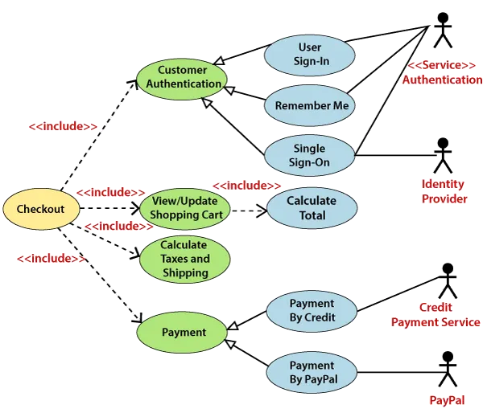
  이미지 출처: [medium](https://medium.com/@manojsharmajtp2/what-is-a-uml-use-case-diagram-976ac1d69a9d)
  
  - 요구사항 분석의 출발점, 액터와 시스템 기능 정의
  - 이후 시퀀스·클래스 다이어그램 설계의 기반
- **클래스 다이어그램**
  
  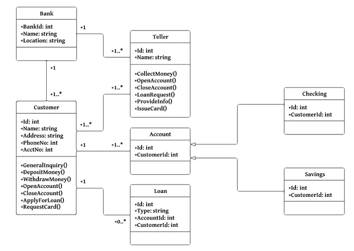
  
  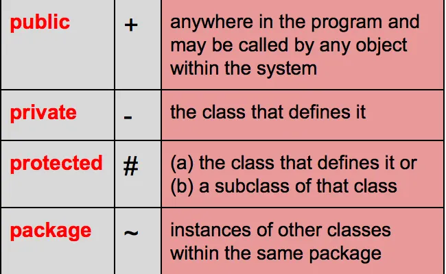
  
  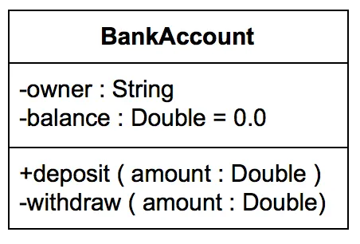
  
  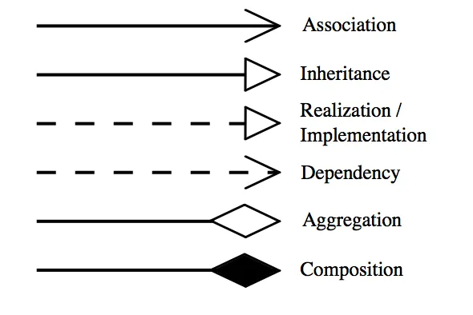
  
  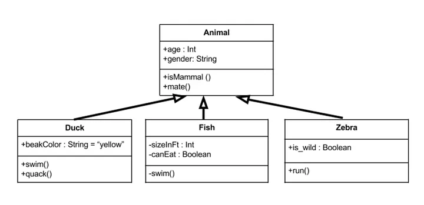
  
  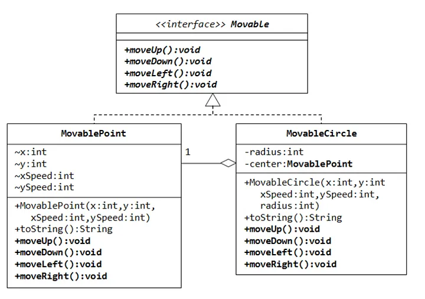
  
  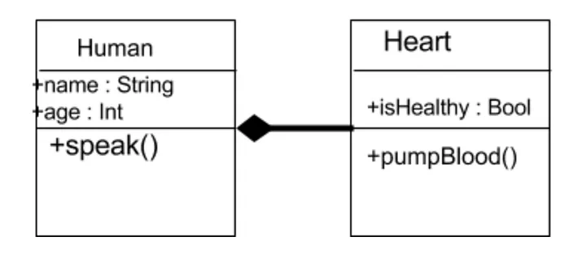
  
  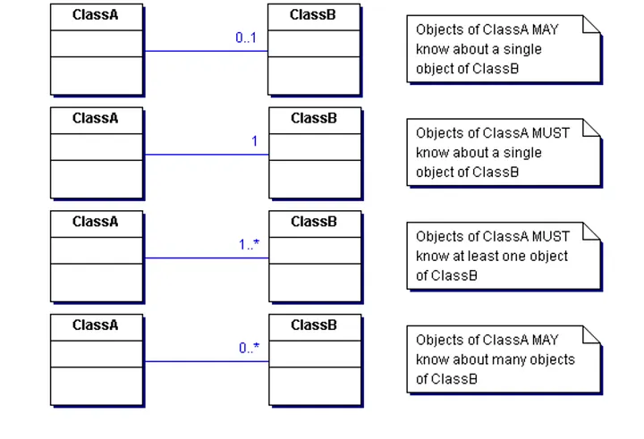
  
  이미지 출처: [medium](https://medium.com/@smagid_allThings/uml-class-diagrams-tutorial-step-by-step-520fd83b300b)
  
  - 정적 구조 모델링 (속성, 메서드, 관계)
- **시퀀스 다이어그램**
  
  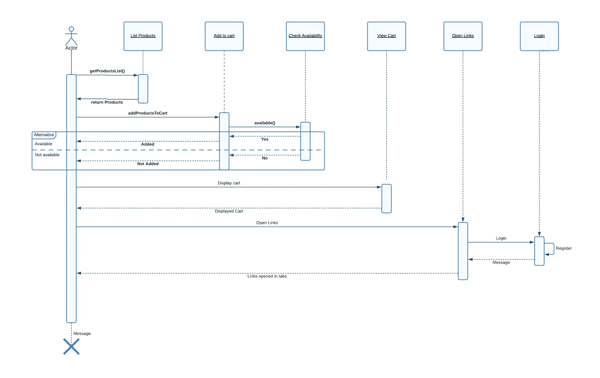
  이미지 출처: [medium](https://medium.com/@nynptel/unlocking-the-power-of-sequence-diagrams-in-software-design-c8e3587fd8f4)
  
  - 객체 간 메시지 흐름(동적 행위) 표현
- **액티비티 다이어그램**
  
  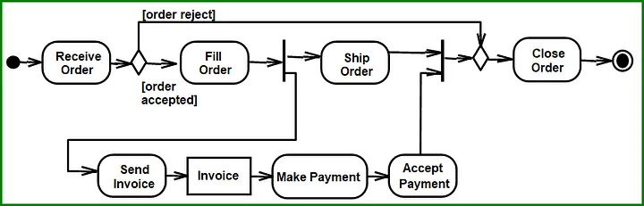
  
  이미지 출처: [medium](https://medium.com/@joshuaudayagiri/uml-activity-diagram-36aea144793b)
  
  - 업무 절차, 조건, 병렬, 반복 흐름 표현
- **추천 순서**: **유스케이스 → 클래스 → 시퀀스 → 액티비티**
- **대응 개념**: Top-down 분석 vs Bottom-up 설계

------

#### UML 클래스 다이어그램의 관계

| 관계                       | 설명                                     | 반대/대응 개념                          |
| -------------------------- | ---------------------------------------- | --------------------------------------- |
| **합성(Composition)**      | 전체-부분 관계, 전체 소멸 시 부분도 소멸 | 집합(Aggregation): 부분 독립 생존 가능  |
| **의존(Dependency)**       | 일시적 참조, 기능 의존                   | 연관(Association): 지속적 참조          |
| **일반화(Generalization)** | 상속 관계 (is-a)                         | 구현(Realization): 인터페이스 구현 관계 |

------

#### 시퀀스 다이어그램 제어 구조

- **alt**: 조건 분기(If-Else)
- **opt**: 단일 조건 실행(Optional)
- **loop**: 반복 구조
- **par**: 병렬 처리
- **조합 예시**: 동시성과 조건 분기를 동시에 → **par + alt**
- **대응 개념**: 순차 실행(seq), self 메시지(자기 호출)

------

#### 액티비티 다이어그램 종료 조건

- **포크(Fork)**: 흐름 병렬 분기
  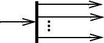
- **조인(Join)**: 모든 병렬 흐름이 완료되어야 합침
  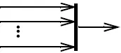
- **병합(Merge)**: 여러 대체 경로 중 하나라도 도착 시 다음 단계 진행
  - 단, 나머지 경로 실행은 중단되지 않음
    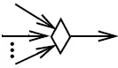
- **전체 종료 조건**: "둘 중 하나라도 완료 시 전체 종료" → Fork + 각 경로에 **Terminate End Node**
- **대응 개념**:
  - Fork+Join → 모든 경로 완료 후 진행
  - Fork+Merge → 하나 도착 시 다음 단계 진행(나머지 실행은 계속)
  - Fork+Terminate → 하나라도 종료 시 전체 액티비티 종료

------

#### 유스케이스 다이어그램 액터 일반화

- **일반화(Generalization)**: 상위 액터 기능 상속
  - 일부 액터에만 추가 기능이 있을 때 사용
- **대응 개념**
  - Include 관계: 공통 기능 재사용
  - Extend 관계: 조건부 확장 기능

------

#### 다이어그램 선택 기준

- **액티비티 다이어그램**
  - 데이터 흐름 + 조건 분기 + 병렬 처리 + 반복 로직 표현 가능
  - 비즈니스 프로세스 모델링 적합
- **대응 개념**
  - 시퀀스 다이어그램: 메시지 중심
  - 상태 다이어그램: 상태 전이 중심

------

#### Boundary-Control-Entity (BCE) 패턴

- **Boundary**: UI, 외부 시스템 경계
- **Control**: 비즈니스 로직, 흐름 제어
- **Entity**: 데이터/영속 객체
- **장점**: 역할 분리 → 유지보수, 확장성 ↑
- **대응 개념**: MVC 패턴 (Model-View-Controller)

------

#### 시퀀스 ↔ 클래스 다이어그램 정합성 검증

- **오류 예시**: 시퀀스에서 호출한 메시지가 클래스 다이어그램 오퍼레이션에 없음
- **검증 포인트**:
  - 시퀀스 메시지 ↔ 클래스 메서드 매핑
- **대응 개념**: 속성 매핑 검증(클래스 ↔ 데이터모델)

------

#### 요구사항-구조-행위 UML 조합

- **요구사항 도출** → 유즈케이스 다이어그램
- **정적 구조 설계** → 클래스 다이어그램
- **동적 행위 설계** → 시퀀스 다이어그램
- **대응 개념**: 구조 다이어그램(정적) vs 행위 다이어그램(동적)

------

#### UML 범위와 생명주기 활용

- **구조 다이어그램**
  - 클래스, 컴포넌트, 배치, 패키지
- **행위 다이어그램**
  - 유즈케이스, 시퀀스, 액티비티, 상태, 커뮤니케이션
- **이점**: 설계~유지보수 전 단계에서 동일 모델 재활용
- **대응 개념**: 단발성 문서화 (UML 미사용 시)

------

#### 합성(Composition)

- **전체-부분 관계**, 전체 소멸 시 부분도 소멸
- **기호**: 채워진 마름모
- **대응 개념**: 집합(Aggregation, 빈 마름모)

------

#### 시퀀스 다이어그램 프래그먼트

- **Interaction Fragment**: opt, alt, loop, par 등 제어 구조 표현 블록
- **대응 개념**: 단순 메시지 교환 (제어 구조 없음)

------

#### 유스케이스 다이어그램

- **목적**: 기능 정의, 범위 설정, 액터-기능 관계
- **활용**: 다른 다이어그램 시나리오 도출 기반
- **대응 개념**: 클래스 다이어그램(구조), 액티비티 다이어그램(행위 절차)

------

#### Boundary 클래스

- **의미**: 시스템 경계(UI, 외부 인터페이스)
- **BCE 패턴의 구성요소**
- **대응 개념**: Entity(데이터) 클래스, Control(로직) 클래스

------

#### 포크(Fork) / 조인(Join)

- **포크**: 병렬 분기
- **조인**: 병렬 합류
- **영문**: Fork Node / Join Node
- **대응 개념**: Merge Node(조건 합류), Decision Node(분기)

---

### SW 테스트

#### 테스트 레벨

**단위 테스트(Unit Test)**

- **목적**: 개별 모듈(함수, 클래스)이 의도대로 동작하는지 검증
- **책임 주체**: 개발자
- **도구 예시**: JUnit, pytest
- **자동화 장점**:
  - 반복 실행 효율 ↑
  - 결과 일관성 ↑
- **자동화 한계**:
  - 복잡한 모듈 간 상호작용 결함은 잡기 어려움 → 통합테스트 필요

------

**통합 테스트(Integration Test)**

- **목적**: 모듈 간 인터페이스, 데이터 흐름 검증
- **검증 속성 예시**:
  - **데이터 흐름의 정확성**
  - **인터페이스 일치 여부** (API 스펙, 데이터 포맷 등)
- **추가 관련 개념**:
  - 빅뱅 / 점진적 통합 방식
  - 상향식, 하향식 통합
- **시험 대비 핵심 포인트**:
  - 통합테스트의 핵심 검증 포인트는 *“데이터 흐름 + 인터페이스”*
  - 기능 완결성보다는 모듈 간 연결과 전달 값의 정확성에 초점

------

**시스템 테스트**

- **목적**: 전체 시스템이 요구사항대로 동작하는지 확인
- **범위**: 기능 + 비기능(성능, 보안, 사용성)

------

**인수 테스트(Acceptance Test)**

- **목적**: 계약·요구사항 충족 여부 검증
- **판단 기준**: 테스트 계획서에 정의된 인수 기준
- **특징**: 실사용자/발주자가 참여, 실환경과 유사
- **검증 속성 예시**:
  - **보안(Security)** — 접근제어, 권한검사, 개인정보 처리
  - **사용성(Usability)** — 실제 사용 환경에서의 편의성과 직관성
  - **업무 가능 여부** — 현업 절차와의 적합성
- **반대 개념**: 개발 내부의 **확인 테스트(Verification)**
   인수테스트는 **검증(Validation)** 중심
- **시험 대비 핵심 포인트**:
  - 인수테스트는 통합테스트보다 범위가 넓으며,
     실사용 환경에서 보안·사용성을 반드시 포함해 검증

------

#### 테스트 문서 & 산출물

| 문서                                   | 설명                                                   | 비슷한 개념          | 차이점                    |
| -------------------------------------- | ------------------------------------------------------ | -------------------- | ------------------------- |
| **테스트 계획서**                      | 목적, 범위, 전략, 일정, 자원, 환경, 결함관리 방안 정의 | -                    | 전체 테스트의 설계도      |
| **테스트 시나리오**                    | 요구사항 기반의 업무 흐름별 테스트 설계                | Use Case             | 구체적인 입력·출력 없음   |
| **테스트 케이스**                      | 입력값, 실행 조건, 예상 결과까지 포함한 단위 문서      | 시나리오 기반 세분화 | 실행 가능한 최소 단위     |
| **업무 흐름도(Business Process Flow)** | 업무 절차와 역할을 시각화                              | BPMN                 | 테스트 시나리오 도출 근거 |
| **환경 구성도**                        | 시스템/네트워크 구성도                                 | 아키텍처 다이어그램  | 테스트 환경 명세에 사용   |

------

**요구사항 변경·누락 발견 시 대응 절차**

- 테스트 시나리오 작성 중 요구사항이 누락되었을 경우:
  1. **요구사항 정의서 수정 요청**
  2. **변경관리(Change Management) 프로세스**를 거쳐 공식 반영
  3. **이해관계자(기획, 개발, QA) 승인** 후 문서 업데이트
  4. 테스트 시나리오 및 케이스를 재작성/보완
- **주의**: QA가 임의로 시나리오에 추가하거나, 단순 결함 등록만 하는 것은 범위 일탈(Scope Creep)과 문서 불일치 문제 유발

------

#### 테스트 프로세스 & 절차 용어

- **결함관리**
  - **결함 등록 → 분석 → 수정 → 재확인(Regression/Confirmation) → 종료**
  - **재확인(Confirmation Test)**: 결함 수정 후 해당 결함이 해결됐는지 검증
  - **회귀 테스트(Regression Test)**: 수정으로 인한 다른 영향 여부 확인
  - **중요 원칙**: 결함 상태, 심각도, 발생 위치, 재현 절차를 체계적으로 기록

------

- **결함관리 시 역할 분리 필요성**
  - 결함의 객관적 검증을 위해 **테스트 수행자**와 **결함 관리자**는 분리
  - 결함 관리자는 결함 상태 추적·품질 통계 관리

------

- **보안 데이터 처리**
  - 실제 데이터 사용 금지 (특히 개인정보)
  - 사용 시 반드시 마스킹/익명화
  - 데이터 포맷·구조는 실제와 동일하게

------

#### 반대 개념 / 함께 알아야 하는 개념

| 개념                       | 반대/연관 개념           |
| -------------------------- | ------------------------ |
| 경계값 분석(BVA)           | 등가분할(EP)             |
| 단위테스트                 | 통합테스트               |
| 확인(Verification)         | 검증(Validation)         |
| 결함 재확인(Confirmation)  | 회귀 테스트(Regression)  |
| Strong Consistency         | Eventual Consistency     |
| 하향식 통합                | 상향식 통합              |
| 요구사항 변경 시 문서 반영 | 변경 미반영(Scope Creep) |

---

### SW 개발 방법론

#### 폭포수(Waterfall) 모델

- **정의**: 소프트웨어 개발을 **요구분석 → 설계 → 구현 → 테스트 → 유지보수** 순서로 진행하는 전통적 모델
- **특징**
  - 단계별 **순차적** 진행
  - 각 단계 완료 후 **다음 단계로 이동** (회귀 어려움)
  - 변경 반영이 **후반 단계에서 어려움**
  - 문서화·통제 중시
- **장점**
  - 대규모·명확한 요구사항에 적합
  - 문서 기반 관리 → 인수·검증 용이
- **단점**
  - 요구사항 변경에 취약 (후반부 수정 비용 ↑)
  - 고객 피드백 반영 지연
- **반대 개념**
  - **애자일(Agile)**: 반복적·점진적 개발, 유연한 변경 대응
  - **프로토타이핑 모델**: 초기 시제품 제공, 피드백 반영

------

#### 구조적 방법론 vs 객체지향 방법론

**구조적 방법론**

- 절차(프로세스) 중심 설계
- 데이터와 기능 분리
- **장점**: 명확한 단계 구분, 관리 용이
- **단점**: 변경·확장 시 영향 범위 큼

**객체지향 방법론**

- 데이터와 기능(메서드)을 **객체 단위로 캡슐화**
- 주요 특성: **캡슐화(Encapsulation)**, **상속(Inheritance)**, **다형성(Polymorphism)**
- **장점**: 재사용성, 확장성, 유지보수성 ↑
- **단점**: 초기 학습 곡선 높음, 설계 복잡 가능
- **반대 개념**: 절차지향(Procedural) / 구조적 설계

------

#### 애자일(Agile) 방법론

- **정의**: 2001년 **애자일 선언문**을 통해 공식화된 개발 철학
- **핵심 가치**
  - 프로세스·도구보다 **개인과 상호작용**
  - 포괄적 문서보다 **작동하는 소프트웨어**
  - 계약 협상보다 **고객과의 협력**
  - 계획 준수보다 **변화 대응**
- **특징**
  - **반복적·점진적 개발**
  - 고객 참여와 피드백 중심
  - 짧은 주기(Iteration/Sprint)로 산출물 검토·개선
- **대표 프레임워크**: **SCRUM**, Kanban, XP
- **반대 개념**: 폭포수(순차 진행)

------

#### SCRUM 프레임워크

- **역할**
  - **Product Owner(제품 책임자)**: Product Backlog 관리, 우선순위 설정
  - **Scrum Master**: 스크럼 원칙 준수, 장애 제거, 프로세스 관리
  - **Development Team**: Sprint Backlog의 작업 수행
- **산출물**
  - **Product Backlog**: 전체 요구사항 목록
  - **Sprint Backlog**: 해당 스프린트에서 수행할 작업 목록
  - **Increment**: 스프린트 종료 시 완성된 제품 증분
- **프로세스**
  - Sprint 계획 → Daily Scrum → Sprint 실행 → Sprint 검토 → Sprint 회고
- **특징**
  - 2~4주 주기 반복 개발
  - 지속적인 고객 피드백 반영

------

#### SDLC (Software Development Life Cycle)

- **정의**: 소프트웨어 개발의 **전체 생명주기**를 정의하는 관리 프레임워크
- **단계**: 기획 → 분석 → 설계 → 구현 → 테스트 → 배포/운영 → 유지보수 → 폐기
- **SW 개발방법론과의 관계**
  - **SDLC**: "무엇을" 할지 정의 (단계/활동)
  - **개발방법론**: "어떻게" 할지 정의 (절차/기법)
- **유사 개념**: PDLC(Program Development Life Cycle)

------

#### SW 개발방법론 구성 요소

- **기법(Technique)**: 분석, 설계, 구현 시 사용하는 방법론적 접근
   예: 자료흐름도(DFD), ERD, UML
- **도구(Tool)**: 기법을 지원하는 SW/하드웨어
   예: UML 툴(StarUML), 형상관리툴(Git)

------

#### 정적 분석 vs 동적 분석(객체지향 분석 단계)

- **정적 분석(Static Analysis)**:
  - 클래스, 객체, 관계, 속성 도출
  - 시스템의 **구조**를 모델링
- **동적 분석(Dynamic Analysis)**:
  - 시퀀스 다이어그램, 상태 다이어그램 등으로 **객체 간 상호작용** 분석
  - 동작 방식, 흐름 이해
- **목적**: 구조 + 동작을 함께 분석해 **정확하고 현실적인 모델링** 달성

------

#### 팀 구조 비교(Agile vs 전통적 방법론)

| 구분      | Agile                        | 전통적(폭포수) 방법론 |
| --------- | ---------------------------- | --------------------- |
| 구조      | 자율적, 협업 중심, 다기능 팀 | 계층적, 분업 중심     |
| 의사결정  | 팀 내부 자율, 고객 참여      | 상위 관리자 중심      |
| 역할 구분 | 유연, 다역할 수행 가능       | 엄격한 역할 분리      |

------

#### 주요 키워드 연결

| 개념      | 유사/연관 개념     | 반대 개념       |
| --------- | ------------------ | --------------- |
| 폭포수    | 구조적 방법론      | 애자일          |
| 객체지향  | 캡슐화·상속·다형성 | 구조적/절차지향 |
| 애자일    | 반복·점진적 개발   | 폭포수          |
| SDLC      | 개발 방법론        | -               |
| 정적 분석 | 구조 모델링        | 동적 분석       |
| 동적 분석 | 행위 모델링        | 정적 분석       |
| 기법      | 방법·절차          | 도구            |
| 도구      | SW·HW 지원체계     | 기법            |

---

### BPMN(Business Process Model and Notation)

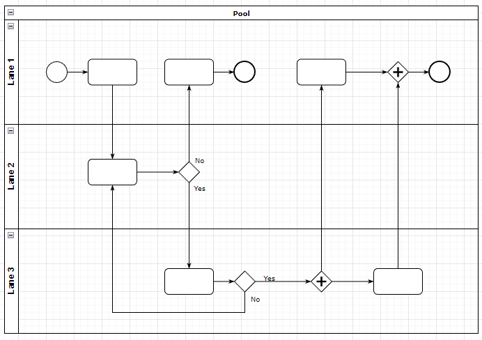

#### 태스크(Task)

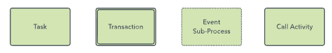

- 업무 단위 (자동화 태스크, 사용자 태스크 등)
- 사람 / 시스템 역할 구분 필요 → **Lane(수영로) / Pool(풀)** 사용

**유사/대조 개념**

- **사용자 태스크(User Task)**: 사람이 처리
- **서비스 태스크(Service Task)**: 시스템 자동 실행
- **스크립트 태스크(Script Task)**: 코드로 실행

------

#### 게이트웨이(Gateway)


- **조건 분기 / 병렬 처리 / 흐름 제어**를 담당
- BPMN 도형: 마름모

**종류**

- **Exclusive Gateway (XOR)**: 조건에 따라 1개의 경로 선택
- **Parallel Gateway (AND)**: 여러 경로 병렬 실행
- **Inclusive Gateway (OR)**: 조건 충족하는 모든 경로 실행
- **Event-based Gateway**: 이벤트 발생 여부에 따라 분기

**반대 개념**


- **시퀀스 플로우(Sequence Flow)**: 순차적 흐름 (단순 직선)
  
- **메시지 플로우(Message Flow)**: 조직 내 다양한 부분에 거쳐 전달되는 메시지를 표시
  
- **연계**: 아티팩트를 이벤트, 활동, 게이트웨이에 연계
  
- 게이트웨이는 "제어 흐름", 시퀀스는 "흐름 연결"

------

#### Sub-Process

- 복잡한 흐름을 묶어 별도 프로세스로 관리
- 예: **데이터 익명화/가명화 과정**을 하나의 Sub-Process로 정의

**비교**

- **Task**: 단일 활동
- **Sub-Process**: 여러 활동 묶음

------

#### 풀(Pool) / 레인(Lane)

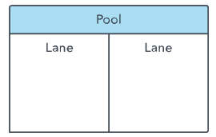

- **Pool**: 참여자(조직, 시스템)
- **Lane**: Pool 내 역할 구분 (사람 vs 시스템)

**실무 포인트**

- 역할 혼동 방지 → 책임 명확화
- 시험 문제에서 자주 "역할 구분을 위해 Lane 사용"이 정답

------

#### 이벤트(Event)


- **Start Event**: 프로세스 시작
- **Intermediate Event**: 중간 이벤트 (메시지, 타이머, 오류 등)
- **End Event**: 종료

**비교**

- 이벤트는 "발생"을 의미, 태스크는 "행위"를 의미

---

#### 아티팩트

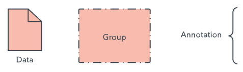

- **데이터** 오브젝트: 활동에 필요한 데이터를 표시
- **그룹**: 논리적으로 그룹화된 활동을 표시
- **주석**: 다이어그램 부분에 대한 추가 설명 제공

---

### MSA

- 서비스 단위 분리, 데이터/로직 독립
- 이벤트 버스, 메시지 큐 → 비동기 통신
- BFF(Backend for Frontend) → 클라이언트 맞춤형 API

**대조**

- **모놀리식 아키텍처**: 한 서비스 안에 모든 기능 구현
- **MSA**: 기능별 분리, 독립 배포/확장 가능

---

### 폴리글롯 퍼시스턴스(Polyglot Persistence)

- 데이터 특성에 따라 다른 저장소 활용
- 예: 센서데이터 = NoSQL, 집계 = RDBMS

**대조**

- **단일 DBMS 전략**: 관리 단순, 확장성 낮음
- **폴리글롯**: 관리 복잡, 성능 최적화

---

### 개인정보 보호 설계

#### 익명화(Anonymization)

- 개인을 절대 식별할 수 없도록 처리
- 재식별 불가능 → 연구/통계에 적합
- 단점: 환자 추적 불가능

#### 가명화(Pseudonymization)

- 환자 ID를 가명으로 치환 (Pseudonym ID)
- 원본 매핑테이블 별도 보관 (암호화/격리)
- 임상/연구 모두 활용 가능

**비교**

- **익명화 vs 가명화**
  - 익명화: 완전히 식별 불가 → 추적 불가
  - 가명화: 관리자가 필요시 재식별 가능 (보안 통제 필요)

---

### 테스트 커버리지 기법

#### 조건/결정 커버리지 (C/DC)

- 조건과 결정(전체 분기)의 참/거짓 결과를 모두 테스트
- 단순히 분기별 True/False만 확인

#### MC/DC (Modified Condition/Decision Coverage, 변경 조건/결정 커버리지)

- **각 조건이 결과에 독립적으로 영향을 미치는지** 검증해야 함
- 즉, 다른 조건을 고정한 상태에서 특정 조건만 바꿔 결과가 바뀌는지 확인
- 100% 보장하려면 모든 조합(예: A,B,C → 2³=8)을 커버하는 테스트가 필요

**비교**

- Statement Coverage (문장 커버리지) → 최소 수준 (모든 코드 실행)
- Branch Coverage (분기 커버리지) → if/else, switch case 모두 탐색
- **MC/DC** → 항공·의료 등 안전성이 중요한 도메인에서 요구되는 최고 수준

---

### 비동기 이벤트 처리 단위 테스트

- **비동기 시스템 특성**: 네트워크 지연, 메시지 순서 뒤바뀜, 장애 상황 발생
- **테스트 방법**
  - 외부 시스템 의존 제거 → **Mock / Stub / Fake / Spy** 같은 테스트 더블 사용
  - 장애 시나리오 시뮬레이션 가능 (네트워크 단절, 메시지 큐 장애)
  - **Spy**: Stub처럼 응답을 흉내낼 뿐 아니라 **호출 횟수, 순서, 파라미터**를 검증 가능 → 이벤트 기반 테스트에 적합

**비교**

- **Stub**: 미리 정해진 응답 반환 (단순)
- **Mock**: 호출 검증 포함 (행위 기반)
- **Spy**: 호출 이력 저장 + 상태 검증 (Stub+Mock 성격 혼합)
- **Fake**: 간단히 동작하는 대체 구현

---

### 화이트박스 테스트

- 내부 코드 로직 기준
- **모든 분기와 조건을 커버** → 숨겨진 오류 발견 가능
- 코드 커버리지 지표 활용 (Statement, Branch, MC/DC 등)

**반대 개념**

- 블랙박스 테스트: 내부 로직 고려하지 않고 입력-출력만 검증 (사용자 관점)
- 그레이박스 테스트: 내부 로직 일부 고려

---

### AI/데이터 파이프라인 테스트

- **AI 모델 성능 테스트**
  - 정확도(Accuracy), 재현율(Recall), 정밀도(Precision), F1 Score
- **데이터 정합성 테스트**
  - 합계, 균형(balance), 형식 유효성, 비즈니스 규칙 준수
  - 예: 회계 데이터 → 차변=대변, 환자 데이터 → ID 유일성

**비교**

- 성능 평가(Test of AI) ↔ 데이터 품질 테스트(Data Integrity Test)

---

### 테스트 자동화 전략

- 대규모 테스트 케이스 → **병렬 실행 + 자동 리포트 분석**
- 자동화 분석: 실패 패턴 클러스터링, 로그 분석, 예외 리포트 생성

**비교**

- 수동 검증: 소규모 프로젝트 가능
- 자동화 검증: MSA, 이벤트 기반, AI/빅데이터 환경 필수

---

### 최신 아키텍처(MSA, BFF, 이벤트 기반) 테스트 특징

- **MSA**: 각 마이크로서비스 단위 테스트 + 계약 기반 테스트 (Contract Testing) 필요
- **BFF(Backend for Frontend)**: 클라이언트 맞춤 API → UI/UX 요구사항 테스트 포함
- **이벤트 기반 메시징**: 메시지 지연, 순서 바뀜, 중복 수신 테스트 필수

**주의**

- 새로운 아키텍처 환경에서도 **기존 품질 관리 원칙을 반드시 유지**해야 함
- 단순히 "새 기술이니까 예외 상황 테스트 생략" X

---

### 마이크로서비스 & 신뢰성 아키텍처

#### MSA(Microservices Architecture)

- 기능별 서비스 독립 배포/확장
- Polyglot persistence (서비스별 DB 선택 가능)
- 장애 격리, 확장성 우수

#### 이벤트 드리븐 아키텍처(Event-driven Messaging)

- MQ/Kafka 등 활용 → 비동기 통신
- 실시간 데이터 스트림 처리 가능

#### 서킷브레이커(Circuit Breaker) 패턴

- 외부 호출 장애 시 연쇄 장애 방지
- 장애 서비스와 회로 차단 후 fallback 처리

#### Active-Active 이중화

- 서비스 인스턴스를 여러 리전에 동시에 띄워 **복원력(Fault Tolerance)** 확보

**대조 개념**

- **모놀리식**: 단일 코드베이스, 배포/확장 어려움
- **MSA**: 독립 서비스, 유연성↑, 복잡도↑

---

### 개인정보 보호 & RAG 아키텍처

#### 가명화(Pseudonymization)

- 환자ID를 **가명ID**로 대체
- 원본 ↔ 가명 매핑 테이블은 암호화/격리 저장 (예: HSM)

#### 익명화(Anonymization)

- 개인 식별 불가능
- 재식별 불가 → 연구에는 사용 가능, 임상 추적은 불가

#### 보안 아키텍처 기법

- **Zero Trust**: 네트워크 내부/외부 구분 없이 모든 요청 검증
- **ABAC** (Attribute-Based Access Control): 속성 기반 접근통제
- **RBAC** (Role-Based Access Control): 역할 기반 접근통제
- **MAC/DAC**: 강제/임의 접근 통제 (군/정부 수준)

**RAG와 보안 결합**

- 환자 데이터는 가명화된 ID로 처리
- RAG 검색 시 **벡터DB** 활용
- 접근은 Zero Trust + ABAC 기반 통제

---

### 멀티테넌트 ERP SaaS 아키텍처

#### 멀티테넌트(Multi-tenant)

- 여러 고객 데이터를 **논리적 분리**하여 한 플랫폼에서 서비스
- 테넌트 식별자(Tenant ID) 포함 인조키
- 서비스별 DB 스키마 분리 or 단일 스키마에 테넌트 컬럼 구분
- 컨테이너 오토스케일링으로 확장성 보장

**대조**

- 싱글테넌트: 고객사별 완전 독립 인프라 → 보안↑, 비용↑
- 멀티테넌트: 공유 인프라 → 비용↓, 관리 효율↑

---

### Edge-Cloud 통합 아키텍처

#### Edge Computing

- 현장에서 실시간 추론/제어
- 네트워크 지연 ↓

#### Cloud Computing

- 중앙 집계, AI 재학습, 장기 분석

#### 통합 패턴

- **메시징(Kafka/MQTT)** 기반 이벤트 수집
- **Event Sourcing**: 모든 상태 변경을 이벤트 로그로 기록
- **State Machine**: 품질 판정/제어 흐름 일관성 유지

**대조**

- 배치 동기화(FTP, 파일 업로드) → 지연/정합성 문제
- 이벤트 기반 실시간 통합 → 최신 상태 보장

---

